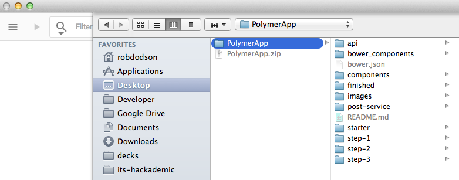
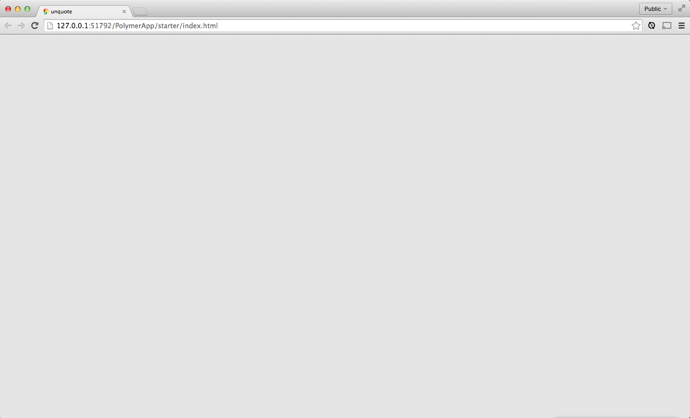

<toc-element></toc-element>

  <google-youtube
    videoid="uDw50BloI2Q"
    width="16"
    height="9"
    rel="0"
    autoplay="0"
    fluid>
  </google-youtube>

### The Goal

In this tutorial, you'll build a small Polymer application -- a very basic client for a social networking service. The end result will look like this:

<figure layout vertical center>
  
  <figcaption>
    Click screenshot for demo
  </figcaption>
</figure>

There's a lot of ground to cover, so let's get started!

### Create a new project

<!-- Chrome Dev Editor callout block -->
<aside class="callout">
This codelab uses **Chrome Dev Editor**, a Chrome app IDE.

  Run Chrome Dev Editor by clicking its icon at the bottom of your screen:
  <figure>
    
  </figure>

If you don't have it installed yet, please
[install it from Chrome Web Store](https://chrome.google.com/webstore/detail/spark/pnoffddplpippgcfjdhbmhkofpnaalpg).

</aside>
<!-- End of Chrome Dev Editor callout block -->

  <ul>
    <li>
      <a href="zips/PolymerApp.zip">Download the project source</a> and save it to your computer.
    </li>
    <li>
      Unzip the project file, there should be one `PolymerApp` directory.
    </li>
  </ul>

  <ul>
    <li>
      In Chrome Dev Editor, click  and select `Open Folder...`
    </li>
  </ul>
  

    
  

  <ul>
    <li>
      Select the `PolymerApp` directory to load it into the editor.
    </li>
  </ul>
  

    
  

You should see the following structure in your editor's sidebar.

    PolymerApp/
      api/          <!-- a fake API for our app to consume -->
      components/   <!-- installed dependencies from Bower -->
      images/
      post-service/ <!-- a component used in the tutorial -->
      starter/      <!-- the starting point for your project! -->
      step-2/       <!-- checkpoint steps, for reference -->
      step-3/
      step-4/
      step-5/
      .bowerrc      <!-- bower configuration file -->
      .gitignore
      bower.json    <!-- bower metadata file. Used for managing dependencies -->

### Preview the app

&rarr;  Open `starter/index.html` and hit the  button in the top toolbar to run the app.

Chrome Dev Editor fires up a web server and navigates to the `index.html` page. This is great way to preview changes as you make them.

<figure>
  
  <figcaption>Preview of index.html</figcaption>
</figure>

You won't see much, just a grey background, but it at least lets us know that our server is running and we're ready to start hacking!

### Summary

In this step, you learned how to:

- Load a project into Chrome Dev Editor
- Run Chrome Dev Editor's web server to preview the app

### Next up

At this point the app doesn't do much. Let's add some code!
