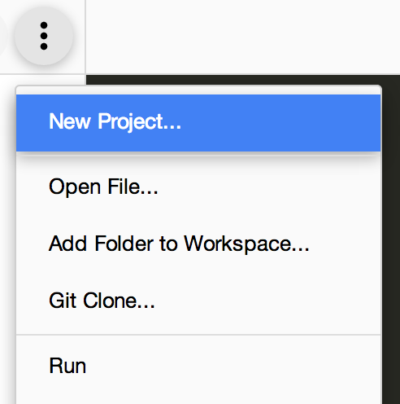
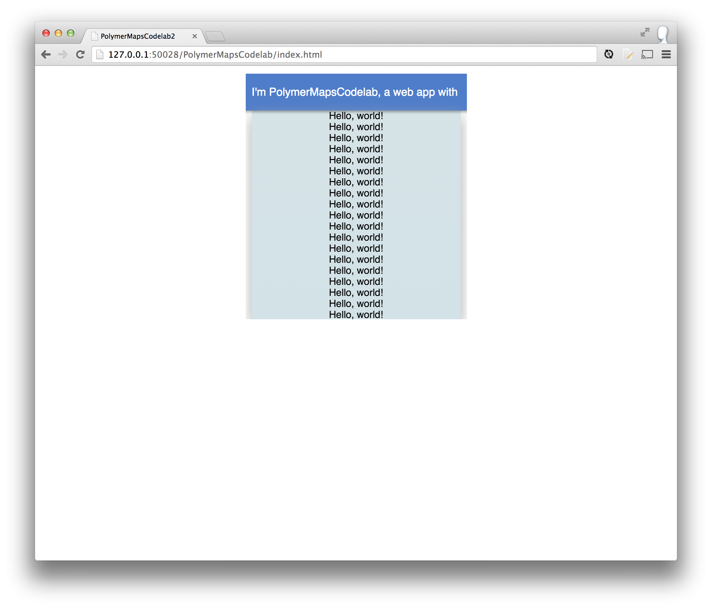

<toc-element></toc-element>

### What you'll build

In this tutorial, you'll build a small Polymer application -- a very basic client for a social networking service. The end result will look like this:

<figure layout vertical center>
  
  <figcaption>
    Click screenshot for demo
  </figcaption>
</figure>

There's a lot of ground to cover, so let's get started!

### Create a new project

<!-- Chrome Dev Editor callout block -->
<aside class="callout">
This codelab uses **Chrome Dev Editor**, a Chrome app IDE.

  Run Chrome Dev Editor by clicking its icon at the bottom of your screen:
  <figure>
  
  </figure>

If you don't have it installed yet, please
[install it from Chrome Web Store](https://chrome.google.com/webstore/detail/spark/pnoffddplpippgcfjdhbmhkofpnaalpg).

</aside>
<!-- End of Chrome Dev Editor callout block -->

Fire up Chrome Dev Editor and start a "JavaScript Web app using Polymer".

  <ul>
    <li>Click  to start a new project.</li>
  </ul>
  

    
  

  <ul>
    <li>Enter <b>"PolymerApp"</b> as the <b>Project name</b>.</li>
    <li>In the <b>Project type</b> dropdown, select "JavaScript web app using
       Polymer".</li>
    <li>Click the <b>Create</b> button.</li>
  </ul>
  

    
  

Chrome Dev Editor creates a basic scaffold for your Polymer app. In the
background, it also uses [Bower](http://bower.io/) to download and install a
list of dependencies (including `polymer.js`) into the `bower_components/`
folder. You'll learn more about using Bower in the next step.

    PolymerApp/
      bower_components/ <!-- installed dependencies from Bower -->
      bower.json  <!-- Bower metadata file. Used for managing dependencies -->
      index.html  <!-- your app -->
      main.js
      styles.css

### Preview the app

At any point, hit the  button in the
top toolbar to run the app. Chrome Dev Editor fires up a web server and
navigates to the `index.html` page. This is great way to preview changes as you
make them.

<figure>
  
  <figcaption>Preview of index.html</figcaption>
</figure>

### Summary

In this step, you learned how to:

- Create a new Polymer application
- Run Chrome Dev Editor's web server to preview the app

### Next up

At this point the app doesn't do much. Let's add a map!
