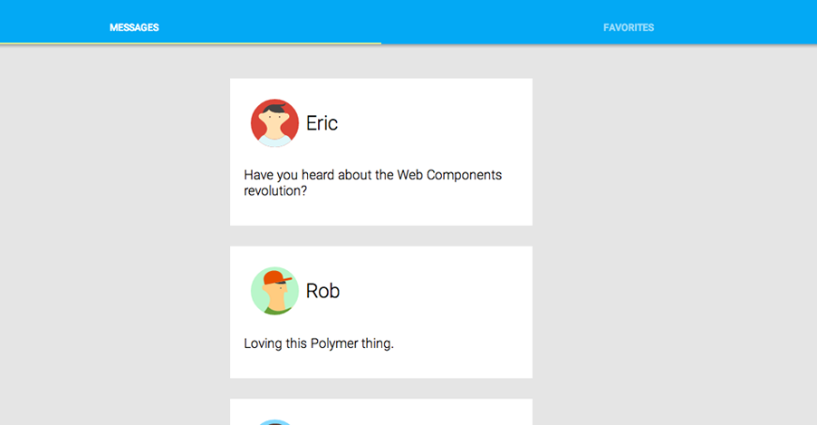

<toc-element></toc-element>

One post is nice, but the app looks a little empty. In this step, you'll pull data from a web service and use Polymer's data binding to render it as a series of cards. 

To get the data, you'll use the `<post-service>` element provided as part of the starter app. This element provides a very simple API for an imaginary social network. In this section, you'll use the `posts` property, which returns an array of `post` objects like this:


    {
      "uid": 2,
      "text" : "Loving this Polymer thing.",
      "username" : "Rob",
      "avatar" : "../images/avatar-02.svg",
      "favorite": false
    }

In this section you'll learn about:

-   Using data binding.
-   Publishing properties.

### Edit the `<post-list>` element

<div class="yt-embed">
  <google-youtube
    videoid="kbluOc97TJk"
    width="16"
    height="9"
    rel="0"
    autoplay="0"
    fluid>
  </google-youtube>
</div>

&rarr; Open the `post-list.html` file in your editor.

```side-by-side
<link rel="import" href="../components/polymer/polymer.html">
<link rel="import" href="../post-service/post-service.html">
<link rel="import" href="post-card.html">

<polymer-element name="post-list" attributes="show">
  <template>
    <style>
    :host {
      display: block;
      width: 100%;
    }
    post-card {
      margin-bottom: 30px;
    }
    </style>
    
    <!-- add markup here -->
...
```

<ul class="side-by-side">
  <li>The file already includes an import for the <code>&lt;post-service&gt;</code>
  element, so it's ready to use.</li>
  <li>The <code>attributes="show"</code> attribute creates a 
  <a href="/docs/polymer/polymer.html#published-properties">
  <em>published property</em></a> named <code>show</code>.
  </li>
</ul>

A <a href="//polymer-project.org/docs/polymer/polymer.html#published-properties"> <em>published property</em></a> is a property that can be configured in markup using an attribute, or connected to another property using two-way data binding. You'll use the `show` property in a later step.

<hr>

#### Connect the `<post-service>`

<div class="yt-embed">
  <google-youtube
    videoid="Eia83Eg1A5c"
    width="16"
    height="9"
    rel="0"
    autoplay="0"
    fluid>
  </google-youtube>
</div>

&rarr; Add a `<post-service>` element inside the element's `<template>`:

```side-by-side
<!-- add markup here -->
<post-service id="service" posts="{{posts}}">
</post-service>
```

<ul class="side-by-side">
  <li>
    The <code>posts="{{posts}}"</code> attribute adds a two-way data binding between 
    the <code>&lt;post-service&gt;</code> element and the <code>&lt;post-list&gt;</code> element.
  </li>
</ul>

The [_data binding_](//polymer-project.org/docs/polymer/databinding.html) links the service element's `posts` property to a local property (also called 
`posts` here). Any methods you define on your custom element can access the response as `this.posts`.

<hr>

#### Render a dynamic list of cards.

&rarr; Add the following `<div>` and `<template>` tag:

```side-by-side
<post-service id="service" posts="{{posts}}">
</post-service>

<!-- Add the following code: -->
<div layout vertical center>

  <template repeat="{{post in posts}}">
    <post-card>
      
      <h2>{{post.username}}</h2>
      <p>{{post.text}}</p>
    </post-card>
  </template>
  
</div>
```

 <ul class="side-by-side">
   <li>This new syntax <code>repeat="{{post in posts}}"</code>, tells the template to
   create a new instance for each item in the <code>posts</code> array.</li>
   <li>In each template instance, the individual bindings (such as
   <code>{{post.avatar}}</code>) are replaced by the corresponding values for that 
   item.</li>
 </ul>

<hr>

#### Import the `<post-list>` element into `index.html`.

<div class="yt-embed">
  <google-youtube
    videoid="Uwl8GtxLJCQ"
    width="16"
    height="9"
    rel="0"
    autoplay="0"
    fluid>
  </google-youtube>
</div>

&rarr; Open `index.html` and add an import link for `post-list.html`. You can replace the existing link for `post-card`:

```
<link rel="import" href="../components/paper-tabs/paper-tabs.html">
<!-- Add the following import: -->
<link rel="import" href="post-list.html">
```

<hr>

#### Use the `<post-list>` element.

&rarr; Find the `<post-card>` element you added in the last step and replace it 
with a `<post-list>`:

    <div class="container" layout vertical center>
      <!-- Replace the post-card with a post-list, like so: -->
      <post-list show="messages"></post-list>
    </div>


### Run the app

Make sure you have `index.html` open, then hit the  button! Your application should now look like this:

<div layout vertical center>
  
</div>

If you have any problems, check your work against the files in the `step-4` folder:

-   [`post-list.html`](https://github.com/robdodson/its-hackademic/blob/master/static/codelabs/1-polymer-first-app/PolymerApp/step-4/post-list.html)
-   [`index.html`](https://github.com/robdodson/its-hackademic/blob/master/static/codelabs/1-polymer-first-app/PolymerApp/step-4/index.html)

<aside class="callout">
  <b>Explore:</b>

  <p>Open up `post-service.html` to see how the component works. Internally, it uses the <code>
<a href="//polymer-projet.org/docs/elements/core-elements.html#core-ajax">&lt;core-ajax&gt;</a></code> element to make HTTP requests.</p>
</aside>

### Summary

In this step, you learned how to:

- Use data binding
- Publish properties

### Next up

Finishing touches
