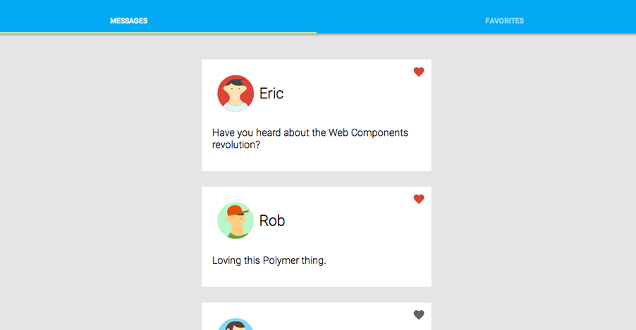

<toc-element></toc-element>

In this section, you'll finish up the app by adding a favorite button to the cards and connecting the tabs to the `<post-list>` control.

In this section you'll learn about:

-   Declarative event handling.
-   Adding properties and methods to the element's prototype.
-   Automatic node finding.

### Edit post-card.html

<div class="yt-embed">
  <google-youtube
    videoid="qym7deY53SY"
    width="16"
    height="9"
    rel="0"
    autoplay="0"
    fluid>
  </google-youtube>
</div>

&rarr; Open `post-card.html` in your editor and add the
<code><a href="/docs/elements/core-elements.html#core-icon-button">&lt;core-icon-button></a></code>
element:

```side-by-side
<div class="card-header" layout horizontal center>
  <content select="img"></content>
  <content select="h2"></content>
</div>

<!-- Add the following code, above the content tag: -->
<core-icon-button
  icon="favorite"
  on-tap="{{favoriteTapped}}">
</core-icon-button>
<!-- End -->

<content></content>
```

<ul class="side-by-side">
  <li>At the top of the `post-card.html` file there should already be an HTML import for the `core-icon-button.html` definition.</li>
  <li>As the name implies, <code>&lt;core-icon-button&gt;</code> creates a button with an
  embedded icon. Polymer includes several sets of
  scalable icons.</li>
  <li>The <code>icon="favorite"</code> attribute selects the heart icon from the
  default icon set.</li>
  <li>The <code>on-tap=</code><wbr><code>"{{favoriteTapped}}"</code> attribute specifies a method to call
  on the <code>post-card</code> element when the button is tapped.</li>
</ul>

<hr>

&rarr; Add the `favorite` property and `favoriteTapped` method to the element's   
prototype. 

```side-by-side
<!-- Add the following code -->
<script>
Polymer({
  publish: {
    favorite: {
      value: false,
      reflect: true
    }
  },
  favoriteTapped: function(event, detail, sender) {
    this.favorite = !this.favorite;
    this.fire('favorite-tap');
  }
});
</script>
```

<ul class="side-by-side">
  <li>The <code>publish</code> object is another way to specify published properties,
  like the <code>attributes</code> attribute shown in the previous step. Here the
  <code>favorite</code> property defaults to <code>false</code>, and it <em>reflects</em>, meaning
  the <code>favorite</code> attribute is updated in the DOM whenever the property value
  changes.</li>
  <li>The <code>favoriteTapped</code> event toggles the state of the <code>favorite</code>
  property (<code>this.favorite</code>), and also fires a custom event, using the
  built in <code>fire</code> method. (<code>fire</code> is one of several utility methods
  Polymer adds to the prototype of every custom element.)</li>
</ul>

The net result of these changes is that when the favorite button is 
tapped, the favorite property is updated and its corresponding attribute 
is set or unset.

Right now, there's no visual indication that the button is pressed.

<hr>

&rarr; Add the following CSS to style the favorite button:

```side-by-side
<!-- Add the following code: -->
core-icon-button {
  position: absolute;
  top: 3px;
  right: 3px;
  color: #636363;
}
:host([favorite]) core-icon-button {
  color: #da4336;
}
</style>
```

<ul class="side-by-side">
  <li>The <code>color</code> property sets the fill color on the icon.</li>
  <li>The <code>:host([favorite])</code> <code>core-icon-button</code> selector sets the
  fill color when the <code>favorite</code> attribute is set on the custom element.</li>
</ul>

<hr>

&rarr; Save `post-card.html`.
   
At this point, you can reload `index.html` and your favorite buttons should 
work, but there are still a few steps left to finish the app.

### Edit app.js

<div class="yt-embed">
  <google-youtube
    videoid="prneaX8RwY0"
    width="16"
    height="9"
    rel="0"
    autoplay="0"
    fluid>
  </google-youtube>
</div>

&rarr; Open `app.js` and update the tab event handler to switch views in 
`<post-list>` when the user switches tabs:

    var tabs = document.querySelector('paper-tabs');

    /* Add the following code: */
    var list = document.querySelector('post-list');

    tabs.addEventListener('core-select', function() {
      list.show = tabs.selected;
    });

&rarr; Save `app.js`.

### Edit post-list.html

&rarr; Open `post-list.html` in your editor.

&rarr; Update the template that creates the `<post-card>` elements to wire up the favorites:

```side-by-side
<template repeat="{{post in posts}}">
  <!-- Add the following code: -->
  <post-card
    favorite="{{post.favorite}}"
    on-favorite-tap="{{handleFavorite}}"
    hidden?="{{show == 'favorites' && !post.favorite}}">
  <!-- End -->
    
    <h2>{{post.username}}</h2>
    <p>{{post.text}}</p>
  </post-card>
</template>
```

<ul class="side-by-side">
  <li><code>favorite=<wbr>"{{post.favorite}}"</code> binds the 
  card's <code>favorite</code> value to the
  value in the array owned by the <code>&lt;post-service&gt;</code>.</li>
  <li>The <code>on-favorite-tap</code> attribute sets up a handler for the
  <code>favorite-tap</code> event fired by the <code>&lt;post-card&gt;</code>.</li>
  <li>The <code>hidden?=</code><wbr><code>"{{}}"</code> expression is special syntax for a boolean
  attribute, which sets the attribute if the binding expression
  evaluates to true. </li>
</ul>

The binding expression for `hidden` actually does the work of switching 
between the Messages and Favorites tabs. The `hidden` attribute is a 
standard HTML5 attribute. The default Polymer style sheet includes a rule to style `hidden` as `display: none` for those browsers that don't support `hidden` natively.

<hr>

<div class="yt-embed">
  <google-youtube
    videoid="aBbs3QUgFHs"
    width="16"
    height="9"
    rel="0"
    autoplay="0"
    fluid>
  </google-youtube>
</div>

&rarr; Add an event handler for the `favorite-tap` event to `post-list.html`:

```side-by-side
<!-- Add the following code: -->
<script>
Polymer({
  handleFavorite: function(event, detail, sender) {
    var post = sender.templateInstance.model.post;
    this.$.service.setFavorite(post.uid, post.favorite);
  }
});
</script>
```

<ul class="side-by-side">
  <li><code>sender<wbr>.templateInstance<wbr>.model</code> is a reference to the model data used
  to construct a template instance. In this case, it includes the <code>post</code>
  object used to create a <code>&lt;post-card&gt;</code>, so you can retrieve its ID and
  <code>favorite</code> value.</li>
  <li><code>this.$.service</code> returns a reference to the <code>&lt;post-service&gt;</code> element.
  Every element in a custom element's shadow DOM that has an <code>id</code>
  attribute is added to the <code>this.$</code> dictionary. This is called
  <a href="/docs/polymer/polymer.html#automatic-node-finding">automatic node finding</a>.</li>
  <li>If this was a real social networking service, the <code>setFavorite</code> method
  would persist the change to the server. As is, it doesn't do anything
  other than log a console message.</li>
</ul>

### Run the app

Make sure you have `index.html` open, then hit the  button! That's it &mdash; you're done!

With a bit of luck, your application looks like this. Try favoriting the second card and clicking on the `Favorites` tab.

<figure layout vertical center>
  <a href="//polymer-project.org/apps/polymer-tutorial/finished/" class="unquote-link">
    
  </a>
  <figcaption>
    Click screenshot for demo
  </figcaption>
</figure>

If your project doesn't look quite right, check your work against the files in the `step-5` directory:

-   [`post-card.html`](https://github.com/robdodson/its-hackademic/blob/master/static/codelabs/1-polymer-first-app/PolymerApp/step-5/post-card.html)
-   [`post-list.html`](https://github.com/robdodson/its-hackademic/blob/master/static/codelabs/1-polymer-first-app/PolymerApp/step-5/post-list.html)
-   [`index.html`](https://github.com/robdodson/its-hackademic/blob/master/static/codelabs/1-polymer-first-app/PolymerApp/step-5/index.html)

### Summary

In this step, you learned how to:

- Work with declarative event handlers
- Add properties and methods to an element's prototype
- Work with automatic node finding
