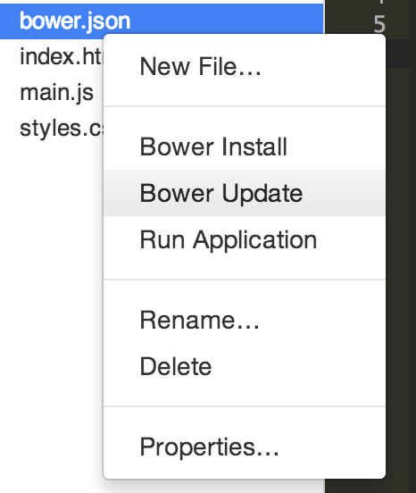
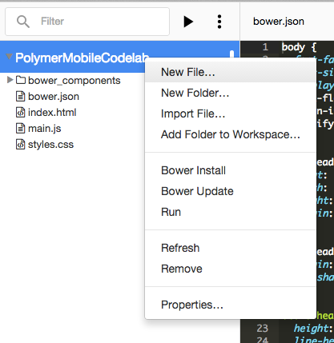

<toc-element></toc-element>

Polymer/core-* elements is a set of visual and non-visual utility elements. 
They include elements for working with layout, user input, selection, and scaffolding apps.
To use them, you first need to install them using Bower.

<aside class="callout">
  <b>What is Bower?</b>
  
<a href="http://bower.io/">Bower</a> is a client-side package management tool that you can use with any web app to take care of the hassles of dependency management. Every Polymer component defines its own set of dependencies. When you install a Polymer component using Bower, the component and its dependencies are installed under <code>bower_components/</code>.

</aside>

### Install core-* elements

If you inspect the `bower_components` directory in your project, you'll see a bunch of `paper-*` components already preinstalled for you. In this codelab, we'll use both `core-*` and `paper-*` elements to build our app.

Normally, you'd run `bower install Polymer/core-elements --save` on the command line to
install all the elements in one go.
However, Chrome Dev Editor does not have a command line for running Bower commands.
Instead, we need to manually edit `bower.json` to include `core-elements`,
then use Chrome Dev Editor's Bower Update feature to
download the paper elements to `bower_components/`.

&rarr; Edit `bower.json` by adding `core-elements` in the `dependencies`:

    "dependencies": {
      ...
      "core-elements": "Polymer/core-elements"
    }

  <ul>
    <li>Right-click the `bower.json` filename in the editor.</li>
    <li>Run <b>Bower Update</b> from the dropdown.</li>
  </ul>
  

    
  

### Install the Roboto font

Similarly, you can use Bower to install the Roboto font.

&rarr; Edit `bower.json` by adding `font-roboto2` in the `dependencies`:

    "dependencies": {
      ...
      "font-roboto": "Polymer/font-roboto"
    }

&rarr; Right-click the `bower.json` filename in the editor and run **Bower Update** from the dropdown.

### Create the app's root element

In the Polymer world, everything is an element. Therefore, our app is an element too.

To create the app's root element, you need to:

1. Create a new file called `codelab-app.html`.
2. Create some basic markup for the element in that file.
3. Use an HTML Import to load the file into `index.html`.
4. Declare an instance of the element on the page.

  <ul>
    <li>Right-click **PolymerMobileCodelab > Add File...**
        in Chrome Dev Editor's sidebar and create a new file
        called `codelab-app.html`.</li>
  </ul>
  

    
  

&rarr; In `codelab-app.html`, paste the basic markup for a Polymer element:

    <link rel="import" href="bower_components/polymer/polymer.html">
    <link rel="import" href="bower_components/font-roboto/roboto.html">

    <polymer-element name="codelab-app">
      <template>
      <link rel="stylesheet" href="styles.css">
      Hello Polymer!
    </template>
    
    </polymer-element>

The Roboto2 font import is not obligatory,
but thanks to it we can use the Roboto font in our app.

&rarr; Open `styles.css` and replace its contents with this CSS rule:

    :host {
      font-family: RobotoDraft, 'Helvetica Neue', Helvetica, Arial;
    }

This CSS file is referenced inside the template of our `codelab-app` element. The rules in this file will be applied to elements inside the root element. The special CSS selector [`:host`](http://www.html5rocks.com/en/tutorials/webcomponents/shadowdom-201/#toc-style-host), introduced by Web Components, styles the root element itself.

<aside class="callout">
  <b>Style encapsulation</b>
  
One of the core features of Web Components is that they provide encapsulation.
  Shadow DOM respects the [shadow boundary](http://w3c.github.io/webcomponents/spec/shadow/#shadow-trees).
  CSS styles defined inside Shadow DOM are scoped to the ShadowRoot. This means styles are encapsulated by default.
  

</aside>

&rarr; In `index.html`, add an [HTML Import](http://www.polymer-project.org/platform/html-imports.html) in the `<head>` that loads `codelab-app.html`.

**Important**: Make sure the HTML Import comes after `platform.js`.

    <head>
      ...
      <link rel="import" href="codelab-app.html">
    </head>

&rarr; Remove the contents of `<body>` and declare `<codelab-app>` instead.

    <body unresolved>
      <codelab-app></codelab-app>
    </body>

### Run the app

&rarr; Select the **index.html** file in Chrome Dev Editor and
click the  button.
At this point, you should see **Hello Polymer** from `codelab-app` rendered on the page.

### Summary

In this step, you learned how to:

- Install `core-*` elements using Bower
- Create the root element and declaratively use it on the page
- Style the host element using CSS

## Next up

At this point the app doesn't do much. Let's add some layout!
