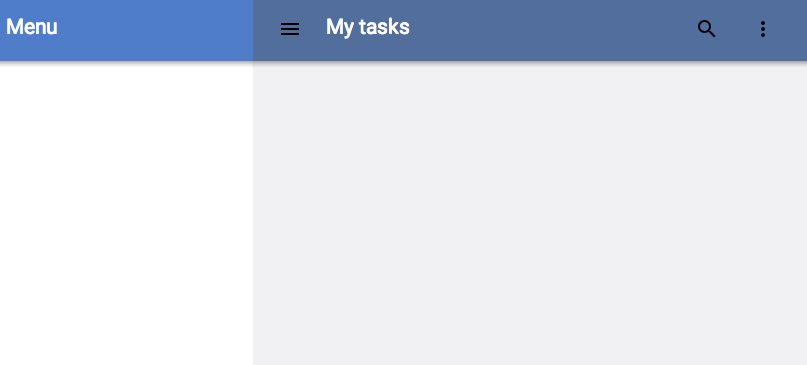

<toc-element></toc-element>

The Polymer/core-* set includes many elements for setting up a responsive layout for an app.
Let's use some of the out-of-the-box elements for quick scaffolding.

### Use a core-drawer-panel element

To use `core-drawer-panel`:

1. Use an HTML Import to load the element into `codelab-app.html`.
2. Declare an instance of the element on the page.

&rarr; In `codelab-app.html`, add imports for `core-drawer-panel`, `core-header-panel`, and `core-toolbar` to the top of the file:

    <link rel="import" href="bower_components/core-drawer-panel/core-drawer-panel.html">
    <link rel="import" href="bower_components/core-header-panel/core-header-panel.html">
    <link rel="import" href="bower_components/core-toolbar/core-toolbar.html">

&rarr; In `codelab-app.html`, inside the `<template>` tag,
remove the **Hello Polymer!** string and declare `<core-drawer-panel>` instead. The drawer panel consists of two parts: `drawer` and `main`. The drawer is a sidebar that is open in desktop applications but closed if the screen size is smaller than `responsiveWidth`. Set `responsiveWidth` to `600px`.

    <template>
      <link rel="stylesheet" href="styles.css">
      <core-drawer-panel responsiveWidth="600px">

        <core-header-panel drawer>
          <core-toolbar>Menu</core-toolbar>
        </core-header-panel>

        <core-header-panel main>
          <core-toolbar>My notes</core-toolbar>
        </core-header-panel>

      </core-drawer-panel>
    </template>

&rarr; Add toolbars to both the drawer and the main section.

    <template>
      <link rel="stylesheet" href="styles.css">
      <core-drawer-panel responsiveWidth="600px">

        <core-header-panel drawer>
          <core-toolbar>Menu</core-toolbar>
        </core-header-panel>

        <core-header-panel main>
          <core-toolbar>My notes</core-toolbar>
        </core-header-panel>

      </core-drawer-panel>
    </template>

### Add icons to the toolbar

Polymer has a convenient [set of icons](http://polymer.github.io/core-icons/components/core-icons/demo.html) that you can use declaratively in your own components.

To add Polymer icons to the toolbar:
1. Add `core-icons` and `paper-icon-button` as dependencies.
2. Use the `icon` property of `paper-icon-button` to display icons on the page.
3. Use the `flex` attribute to align icons to the right.

&rarr; In `codelab-app.html`, add an HTML Import for `core-icons` and `paper-icon-button` to the top of the file. These can come after the imports you added in the previous steps:

    ...
    <link rel="import" href="bower_components/core-icons/core-icons.html">
    <link rel="import" href="bower_components/paper-icon-button/paper-icon-button.html">

&rarr; Add `paper-icon-button` elements to the toolbar. Set their `icon` property to the appropriate icon name.

    <core-header-panel main>
      <core-toolbar>
        <paper-icon-button icon="menu"></paper-icon-button>
        My notes
        <paper-icon-button icon="search"></paper-icon-button>
        <paper-icon-button icon="more-vert"></paper-icon-button>
      </core-toolbar>
    </core-header-panel>

&rarr; Wrap **My notes** into a span and add the `flex` attribute to it.
The `flex` attribute causes the span to take up all available space and
push the icons to the right of the toolbar.

    <core-toolbar>
      ...
      My notes
      ...
    </core-toolbar>

&rarr; Add the following rules to `styles.css`:

    [drawer] {
      background-color: #fff;
    }

    [main] > div {
      padding: 2em;
    }

    [drawer] > core-item {
      padding: 1em;
    }

    [main] paper-checkbox {
      margin-right: 1em;
    }

    [main] {
      height: 100%;
      background-color: #f1f1f3;
    }

    [drawer] core-toolbar {
      background-color: #4F7DC9;
      color: #fff;
    }

    [main] core-toolbar {
      background-color: #526E9C;
      color: #fff;
    }

&rarr; Select **index.html** and preview the app with the  button. 
At this point, you should see a basic layout rendered on the page.

<figure>
  
  <figcaption>index.html with the basic scaffold</figcaption>
</figure>

### Check the responsiveness of the app

To test the responsiveness of the layout, emulate the Nexus 5 in Chrome:

&rarr; Open Chrome Developer Tools by right-clicking the page and selecting **Inspect element**.

&rarr; Open the drawer by clicking the   button.

&rarr; Select the *Emulation* tab, pick *Nexus 5* from the dropdown, and click *Emulate*.
The page should change the display to match the picked device resolution.

&rarr; Refresh the page. The drawer should be hidden by default.

### Summary

In this step, you learned how to:

- Use `<core-drawer-panel>` and `<core-toolbar>` for a basic, mobile-friendly layout
- Use Polymer icons
- Preview your app using mobile device emulation

## Next up

The drawer is closed on mobile by default. Let's add a menu button to let user open the drawer.
