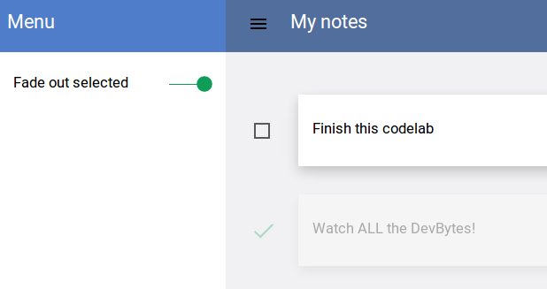
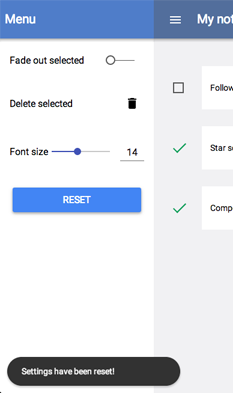

<toc-element></toc-element>

Let's take a look at some controls we can use in our app.

### Install dependencies

&rarr; First, let's install the dependencies we're going to use in this step,
all in one go.

    ...
    <link rel="import" href="bower_components/core-item/core-item.html">
    <link rel="import" href="bower_components/paper-toggle-button/paper-toggle-button.html">
    <link rel="import" href="bower_components/paper-icon-button/paper-icon-button.html">
    <link rel="import" href="bower_components/paper-slider/paper-slider.html">
    <link rel="import" href="bower_components/paper-toast/paper-toast.html">
    ...

### Toggle the opacity of selected notes with paper-toggle-button

This button, when checked, should slightly fade out the selected notes.

&rarr; Add a `core-item` to the drawer, with a `paper-toggle-button` inside.
Add the class `blue` to tweak the default styling. Bind the toggle's checked state to the
`fadeSelected` variable.

    <core-header-panel drawer>
      ...
      <core-item>
        <label flex>Fade out selected</label>
        <paper-toggle-button class="blue" checked="{{fadeSelected}}">
        </paper-toggle-button>
      </core-item>
    </core-header-panel>

&rarr; Add a `data-fade-selected` attribute to the `.content` div and bind it to the `fadeSelected` variable.

    

&rarr; Add a `data-done` attribute to the `.item` div and bind it to the `done` variable.

    <template repeat="{{data}}" >
      

        ...
      

    </template>

&rarr; Add the following rule to `styles.css`.

    *[data-fade-selected="true"] .item[data-done="true"] {
      opacity: 0.3;
    }

This rule sets the opacity of each selected ("done") note to 0.3,
for each note in a container where the value of `data-fade-selected` is true.

<figure>
  
  <figcaption>Selected cards fade out when the toggle button is on</figcaption>
</figure>

### Add a delete button

&rarr; Add another `core-item` with a `paper-icon-button` inside.
Set the button's `icon` attribute to `delete`,
and bind its `on-click` event to a callback named `delete`.

    <core-item>
      <label flex>Delete selected</label>
      <paper-icon-button icon="delete" on-click="{{delete}}"></paper-icon-button>
    </core-item>

&rarr; Add a `delete` callback to the root element's prototype.
This function filters the `data` array
and leaves only notes that are not "done" yet.

    

&rarr; Preview the app with the  button.
Select a few notes, and then delete them using the button.

### Add a slider that changes the font size

&rarr; Add another `core-item` with a `paper-slider` inside.
Wrap the slider in a div with `center horizontal layout` attributes for nice horizontal positioning.
Set the slider's `max` attribute to `32`,
and bind its `value` property to the `fontSize` variable.

    <core-item>
      

        
Font size

        <paper-slider value="{{fontSize}}" max="32" editable></paper-slider>
      

    </core-item>

&rarr; Add a `fontSize` property to the root element's prototype. Add a `fontSizeChanged`
callback that selects all the `.card` elements and changes their style to the appropriate font size.
This callback triggers automatically every time the `fontSize` value changes.

    

&rarr; Preview the app with the  button.
Change the font size using the slider,
and observe the changes in the card display.

### Add a reset button

&rarr; Add one last `core-item` with a `paper-button` inside.
Set the button's `label` attribute to `reset`,
and its `raisedButton` attribute to `true`.
Bind the button's `on-click` listener to a callback named `reset`.

    <core-item>
      <paper-button raisedButton class="colored" label="reset"
                    on-click="{{reset}}"></paper-button>
    </core-item>

&rarr; Edit `styles.css` to add rules for the new button.

    paper-button[raisedButton].colored {
      width: 100%;
      background: #4285f4;
      color: #fff;
      fill: #fff;
    }

&rarr; Define the `reset` callback in the root element's prototype. It resets
`fontSize` and `fadeSelected` to their original values.

    

### Display a notification

&rarr; At the end of the drawer section, add a `<paper-toast>` element.
Give it the ID **toast** and the class **capsule**. Set its `text` attribute to **'Settings have been reset!'**
and `duration` attribute to 800 milliseconds.

    <core-header-panel drawer>
      ...
      <paper-toast id="toast" class="capsule" text="Settings have been reset!"
                   duration="800"></paper-toast>
    </core-header-panel>

&rarr; Trigger the toast element any time the settings are reset, in the `reset` callback:

    

&rarr; Preview the app with the  button.
When you hit the reset button, the settings should go back to their original values, and a notification should be displayed
at the bottom of the page.

<figure>
  
  <figcaption>Notification pops up!</figcaption>
</figure>

### Summary

In this step, you learned how to:

- Use `paper-toggle-button` control
- Use `paper-icon-button` for a nicely styled icon control
- Use `paper-slider` control to change numerical values
- Use `paper-button` control
- Use `paper-toast` to display notifications

## Next up

Apply Paper effects to the elements.

