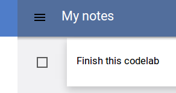
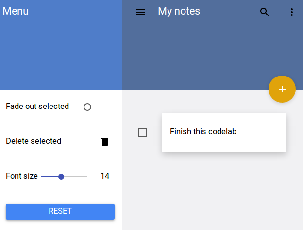

<toc-element></toc-element>

Polymer's `<paper-*>` set provides some interesting effects that can be applied
to your elements. Let's take a look at a few of them.

### Add shadows to cards

&rarr; Install a `paper-shadow` dependency.

    ...
    <link rel="import" href="bower_components/paper-shadow/paper-shadow.html">
    ...

&rarr; Add a `<paper-shadow>` element around the card div. Set its `z` attripbute to `2` -
it defines the *depth* of the shadow.
    
    <paper-shadow z="2">
      

        
{{body}}

      

    </paper-shadow>

<figure>
  
  <figcaption>Cards now have a shadow!</figcaption>
</figure>

### Add a ripple effect to cards

Paper elements can have a nice ripple effect when clicked.
You can try it out by clicking the FAB; depending on where the click occurs,
a colored ripple propagates through the element.

&rarr; Install a `paper-ripple` dependency.

    ...
    <link rel="import" href="bower_components/paper-ripple/paper-ripple.html">
    ...

&rarr; Add `<paper-ripple>` at the bottom of the `.card` div.
Add the `recenteringTouch` class to make it react to user actions.

    

      ...
      <paper-ripple class="recenteringTouch" fit></paper-ripple>
    

<aside class="callout">
  <b>Note:</b>

The `fit` attribute is one of Polymer's [layout attributes](https://www.polymer-project.org/docs/polymer/layout-attrs.html#general-purpose-attributes). It sets `position: absolute` and sets `top:0;right:0;bottom:0;left:0;`

</aside>

&rarr; Open `index.html` and preview the app with the  button.
Click anywhere on the card: a subtle ripple effect should be visible on each click.

### Use waterfall mode

Some elements can get different styling depending on their attributes. For example, in `core-header-panel` the `waterfall` mode changes the behavior of the toolbar: it is flat at the beginning, but adds a shadow when the content gets scrolled under the toolbar.
To check all possible modes visit the [core-header-panel github page](http://polymer.github.io/core-header-panel/components/core-header-panel/demo.html).

&rarr; Add `mode="waterfall"` to the `<core-header-panel>` in the drawer and main section.

    ...
    <core-header-panel drawer mode="waterfall">
    ...
    <core-header-panel main mode="waterfall">
    ...

&rarr; Preview the app with the  button.
Add enough notes for the main section to become scrollable. You should see a shadow under the toolbar when the content scrolls under it.

<figure>
  
  <figcaption>The content is scrolled under the toolbar</figcaption>
</figure>

### Use more space when possible

The `core-drawer-panel` is a responsive element—it closes the drawer when it is in narrow mode (for example, on mobile). You can use the `narrow` property of that element to display a nicer toolbar when the mode is not narrow.

&rarr; Expose the `narrow` property of the `core-drawer-panel`
as a `narrow` variable.

    <core-drawer-panel id="drawerPanel" narrow="{{narrow}}">

&rarr; Add a conditional class to the toolbar
that depends on the `narrow` variable.

The [tokenList](http://www.polymer-project.org/docs/polymer/expressions.html#tokenlist) filter allows you to dynamically set/remove class names based on the object passed to the filter.

    <core-header-panel drawer mode="waterfall">
      <core-toolbar class="{{ {tall : !narrow} | tokenList }}">...</core-toolbar>
      ...
    <core-header-panel main mode="waterfall">
      <core-toolbar class="{{ {tall : !narrow} | tokenList }}">...</core-toolbar>

<figure>
  
  <figcaption>Toolbar is tall in desktop mode and shrinks on mobile</figcaption>
</figure>

### Summary

In this step, you learned how to:

- Use `paper-shadow` to add shadows to elements
- Use `paper-ripple` to add a ripple effect to an element
- Use the `waterfall` property to change the display of the toolbar
- Use the `narrow` property and the `tall` class to change the display of the toolbar

## Next up

Almost finished!
