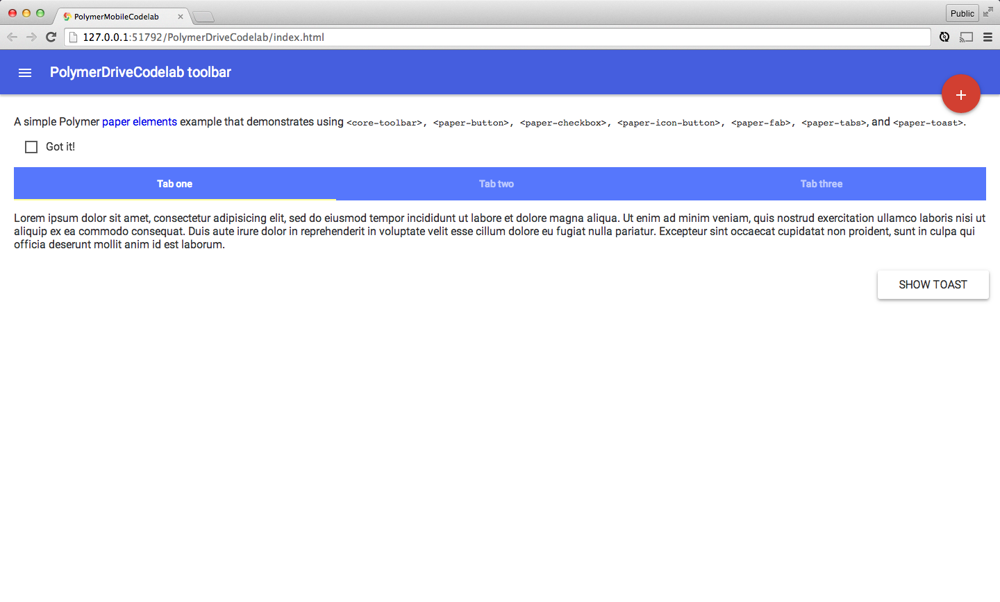

<toc-element></toc-element>

### Create a new project

Fire up Chrome Dev Editor and start a "JavaScript Web app using Polymer".

  <ul>
    <li>In Chrome Dev Editor,
      click  and then
      <b>New Project</b>.</li>
  </ul>
  

    
  

  <ul>
    <li>Enter <b>PolymerDriveCodelab</b> as the <b>Project name</b>.</li>
    <li>In the <b>Project type</b> dropdown, select
      <b>JavaScript web app (using Polymer paper elements)</b>.</li>
    <li>Click the <b>Create</b> button.</li>
  </ul>
  

    
  

**Note:** Chrome Dev Editor may ask you to choose a folder to save projects to if
this is your first project.
You can generally accept the default and proceed or
create and select a new directory.

Chrome Dev Editor creates a basic scaffold for your Polymer app.
In the background, it also uses [Bower](http://bower.io/) to
download and install a list of dependencies (including `polymer.js`)
into the `bower_components/` folder.
You'll learn more about using `bower.json` in the next step.

After installation, your directory structure should look like this:

    PolymerDriveCodelab/
      bower_components/ <!-- installed dependencies from Bower -->
      bower.json        <!-- metadata for managing dependencies -->
      index.html        <!-- your app -->
      main.js
      styles.css

<aside class="callout">

If you receive an error <strong>"Github API Limit Exceeded"</strong> while installing bower dependencies, you can use <a href="zips/PolymerDriveCodelab.zip">this project zip</a> instead.

Unzip the project, and click on <strong>Open Folder...</strong> in the Chrome Dev Editor menu to import it.

It includes all the dependencies to complete this codelab so you should not need to run bower with it.

This is a short term bug in Chrome Dev Editor that will be fixed in the next release.

</aside>

### Preview the app

At any point, select `index.html` and click the
 button in the top toolbar to run the app.
Chrome Dev Editor fires up a web server and navigates to this page.
This is great way to preview changes to the app as you make them.

<figure>
  
  <figcaption>Preview of index.html</figcaption>
</figure>

### Summary

In this step, you learned how to:

- Create a new Polymer application
- Run Chrome Dev Editor's web server to preview the app

## Next up

At this point our app doesn’t do much, so let’s create our first element:
`<drive-app>`. 
