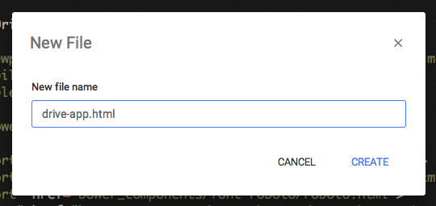
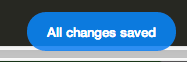

<toc-element></toc-element>

In this step you'll create an element to contain
the UI and logic for uploading files to Google Drive.

###Create a new element

  <ul>
    <li>Right-click the **PolymerDriveCodelab** label in the Chrome Dev Editor sidebar.</li>
    <li>Choose **New File** from the dropdown.</li>
  </ul>
  

    
  

  <ul>
    <li>Call your new file **drive-app.html**.</li>
  </ul>
  

    
  

&rarr;  Inside this file, paste in the following boilerplate for
starting off your element:

    <link rel="import" href="bower_components/polymer/polymer.html">

    <polymer-element name="drive-app">

      <template>
        

        I’m a shiny new element.

      </template>
      

    </polymer-element>

This code defines the `<drive-app>` element as
a tag that your app can use.
The import lets you use Polymer's sugar while you’re authoring.

Chrome Dev Editor should automatically save your changes to the element after
you paste the code in.

<figure>
  
  <figcaption>Chrome Dev Editor saves changes automatically</figcaption>
</figure>

### Import your element

To employ the `<drive-app>` element, you need to:

1. Use an HTML Import to load it into `index.html`.
2. Declare an instance of the element on the page.

&rarr; Start editing `index.html`.

&rarr; In the `<head`> of `index.html`, **add the following line**,
making sure it's after the import of `platform.js`:

    <link rel="import" href="drive-app.html">

&rarr; In the `<body>`, **remove** all existing content and
**declare an instance** of the `<drive-app>` element:

    <drive-app></drive-app> 

### Preview the app

When you select `index.html` and click the 
 button, you should see the 
following in your browser:

<figure>
  
  <figcaption>The current UI of the app</figcaption>
</figure>

Excellent. Your first Polymer element is working,
and you can begin fleshing it out!

## Next up

Install some existing Polymer elements,
so you can use them in your app.
