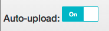

<toc-element></toc-element>

In this step you use Bowser to grab some existing Polymer elements
that you can reuse to start creating your application. 

### Laying the stage

A few pieces would be useful for the app's user interface.

First, the UI could use **toolbars**—one
for the top of the app and one for lower down.

<figure>
  
  <figcaption>A toolbar</figcaption>
</figure>

Even better would be some **responsive layout** that
includes the toolbar and an area for the content.

<figure>
   
  <figcaption>Responsive layout</figcaption>
</figure>

A **splitter** would let the user see what’s been queued to be uploaded
and what has been successfully added to Drive.

<figure>
  
  <figcaption>A splitter</figcaption>
</figure>

A **toggle** button could let the user choose whether
to automatically upload files
or manually upload them via a separate button.

<figure>
  
  <figcaption>A toggle button</figcaption>
</figure>

To install these pre-made elements, you'll use Bower. 

<aside class="callout">
  <b>What is Bower?</b>
  
<a href="http://bower.io/">Bower</a> is a client-side
    package management tool that you can use with
    any web app to take care of the hassles of dependency management.
    Every Polymer component defines its own set of dependencies.
    When you install a Polymer component using Bower,
    the component and its dependencies are installed under
    <code>bower_components/</code>.

</aside>

### Installing the elements

Normally, you'd run
`bower install Polymer/core-scaffold Polymer/core-splitter PolymerLabs/polymer-ui-toggle-button --save`
on the command line to install the elements.
However, Chrome Dev Editor doesn't have a command line for running Bower commands.
Instead, you need to manually edit the `bower.json` file to
include these elements, then use Chrome Dev Editor's Bower Update feature
to download the elements to `bower_components/`.

&rarr; Edit `bower.json` to add the above elements to the dependencies:

    "dependencies": {
      "polymer": "Polymer/polymer#master",
      "paper-elements": "Polymer/paper-elements#master",
      "core-splitter": "Polymer/core-splitter#master",
      "core-scaffold": "Polymer/core-scaffold#master"
    }

  <ul>
    <li>Right-click the filename **bower.json** in the editor.</li>
    <li>Run **Bower Update** from the dropdown.</li>
  </ul>
  

    
  

The download may take few seconds.
You can verify that the elements (and any dependencies)
are installed by checking that the following directories
exist and contain files:

* `bower_components/core-splitter`
* `bower_components/core-scaffold`

## Next up

Learn how to use the elements you just installed to construct the app's UI.
