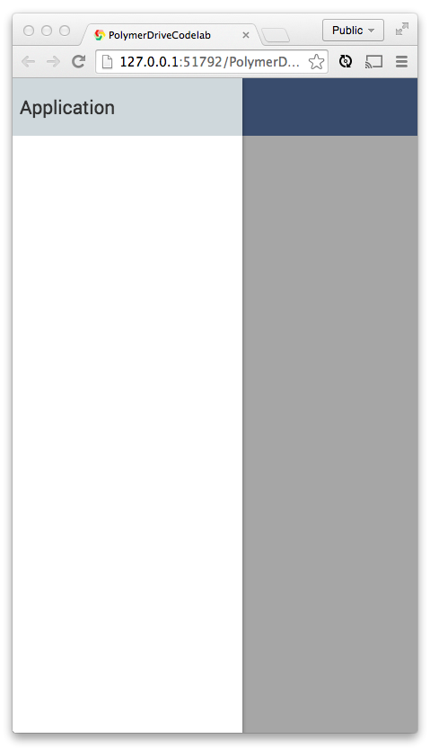

<toc-element></toc-element>

To use the elements you just installed, you need to:

1. Use [HTML Import](http://www.polymer-project.org/platform/html-imports.html)s
to load the elements into `drive-app.html`.
2. Declare instances of the elements.

### Import installed elements

&rarr; In `drive-app.html`, add the following HTML Imports
at the top of the file to load the elements.

    <link rel="import" href="bower_components/core-scaffold/core-scaffold.html">
    <link rel="import" href="bower_components/core-splitter/core-splitter.html">
    <link rel="import" href="bower_components/paper-toggle-button/paper-toggle-button.html">

**Important**: These imports must be **after** the import of `polymer.html`.

You can now use these elements in your app.

### Lay out a page with `<core-scaffold>`

&rarr; Remove the content of the `<template>` inside of `drive-app.html`,
and paste in the following code snippet.

This code declares `<core-scaffold>` with some markup
so that the app gets a **toolbar**, a **menu**,
and an area for the app's **content**.

    <core-scaffold>
      <core-header-panel navigation flex mode="seamed">
        <core-toolbar>
          Application
        </core-toolbar>
      </core-header-panel>
  
      
My Drive App

  
      
Content goes here...

    </core-scaffold>

&rarr; Add the following code to `drive-app.css`

    core-scaffold {
      font-family: 'Roboto', Arial;
    }

**Run the app**

&rarr; When you select `index.html` and click the  button you should now see the following:

<figure>
  
  <figcaption>The app's current UI</figcaption>
</figure>

As you can see, using `<core-scaffold>` is completely declarative!
When you click the hamburger menu icon
, it expands as follows:

<figure>
  
  <figcaption>Clicking the menu displays the left side</figcaption>
</figure>

### Style the toolbar

To give this sidebar a little flare, add the following CSS to `drive-app.css`:

    core-toolbar {
      background-color: #526E9C; 
      color: #fff;
    }

Beautiful. Let's take a look at it:

<figure>
  
  <figcaption>The app's current UI</figcaption>
</figure>

### Summary

In this step you learned how to:

* Install Polymer elements using Bower
* Use the element and declaratively place a toolbar
* Style a custom element using CSS

## Next up

Next, let's scaffold out what the app looks like for a signed-in user with everything they need to upload files.
