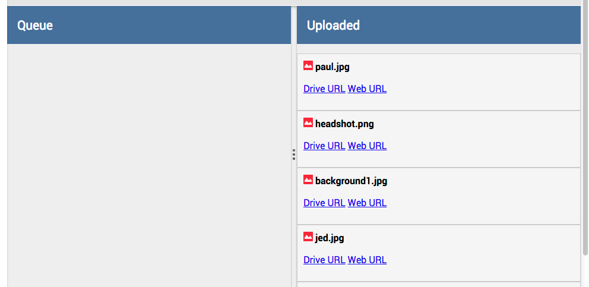
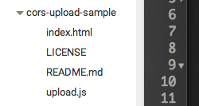

<toc-element></toc-element>

### Add Upload panels

The app needs an area to display the names of files that
the user has _selected_ for uploading,
as well as those that have already been _uploaded_. 
The approach we'll take is to have two panels
containing a toolbar as part of the heading,
with a splitter dividing the **Queue** and **Uploaded** areas. 

<figure>
  
  <figcaption>The proposed UI</figcaption>
</figure>

&rarr; After `<core-toolbar>`, add the following markup:

    

        
      

        <core-toolbar>
Queue
</core-toolbar>
        <ul class="filelist">
          <template repeat="{{file in uploadList}}">
            <li>
            <strong>{{file.name}}</strong> {{file.type}}
            </li>
          </template>
        </ul>
      

      <core-splitter></core-splitter>

      

        <core-toolbar>
Uploaded
</core-toolbar>

        <ul class="filelist">
          <template repeat="{{file in uploadedList}}">
            <li>
             
            <strong>{{file.title}}</strong>
            

            <a href="{{file.selfLink}}">Drive URL</a>
            <a href="{{file.webContentLink}}">Web URL</a>
            

            </li>
          </template>
        </ul>
      

    

&rarr; Add the following lines to the `drive-app.css` file to
improve the look and feel:

    .panel { width: 50% };
    .panel core-toolbar {
      background: rgb(68, 68, 68);
    }

&rarr; Click the  button.

You should now see the following:

<figure>
  
  <figcaption>The app's current UI</figcaption>
</figure>

The app now has most of the UI it needs.
It's time to add the logic to get it working!

### Wire up events for the app

Now you add the JavaScript that brings the markup to life. 

&rarr; After your closing `</template>` tag, add the following code,
which defines some arrays and properties you'll use to work with upload lists:

    

&rarr; Expand that code to add the logic for selecting files and
updating the arrays when files are chosen (note, this replaces the
last snippet):

    

&rarr; Add the following code right before the `selectFiles` function:

    manualUpload: function () { 
      this.uploadFiles(this.queue); 
    },

That code allows the manual upload button to upload files if clicked.

So, you’ve now wired up some of the UI to functions,
but the app is still missing the `uploadFiles` function.

### Implement file uploading

`uploadFiles` can use a little library written by the Google Drive team
that makes working with file uploads easier.
You can use Bower to install the library.

&rarr; Edit `bower.json` to add a dependency on "cors-update-sample".
The dependencies should look like this:

    "dependencies": {
      "polymer": "Polymer/polymer#master",
      "paper-elements": "Polymer/paper-elements#master",
      "core-splitter": "Polymer/core-splitter#master",
      "core-scaffold": "Polymer/core-scaffold#master",
      "cors-upload-sample": "googledrive/cors-upload-sample#master"
    }

  <ul>
    <li>In Chrome Dev Editor, right-click the filename **bower.json**.</li>
    <li>Run **Bower Update** from the dropdown.</li>
  </ul>
  

    
  

&rarr; Make sure that `cors-upload-sample` is in the `bower_components` directory.

<figure>
  
  <figcaption>The bower_components directory should now contain core-upload-sample.</figcaption>
</figure>

Excellent. You can now _reference_ the `upload.js` script that
comes with this package.

&rarr; Add the following `script` tag after
the other HTML imports in `drive-app.html`:

    

&rarr; Add the `uploadFiles` function before the `manualUpload` function:

    uploadFiles: function (files) {
      var uploadedList = this.uploadedList;
      this.$.status.innerHTML = 'Uploading...';

      var f;
      for(var i=0; f = files[i]; i++) {
        var uploader = new MediaUploader({
          file: f,
          token: this.accessToken,
          onComplete: function (data) {
            uploadedList.push(JSON.parse(data));
            this.$.status.innerHTML = 'Upload successful';
            this.uploadList = [];
          }.bind(this)
        });
        uploader.upload();
      }
    },

&rarr; Just above that, add helpers for handling drag and drop, file picking, and
clearing the upload list:

    tapSelect: function (e) {
        this.$.files.click();
    },

    handleDragOver: function (e) {
        e.stopPropagation();
        e.preventDefault();
        e.dataTransfer.dropEffect = 'copy';
    },

    handleFilePick: function (e) {
        e.stopPropagation();
        e.preventDefault();
        this.selectFiles(e.target.files);
    },

    handleFileSelect: function (e) {
        e.stopPropagation();
        e.preventDefault();
        this.selectFiles(e.dataTransfer.files);
    },

    clearUploadList: function () {
        this.uploadedList = [];
        this.uploadList = [];
    },

## Next up

You _almost_ have enough in place to upload files.
The last thing you need is a way to sign users into
their Google Drive account so that uploads work.
