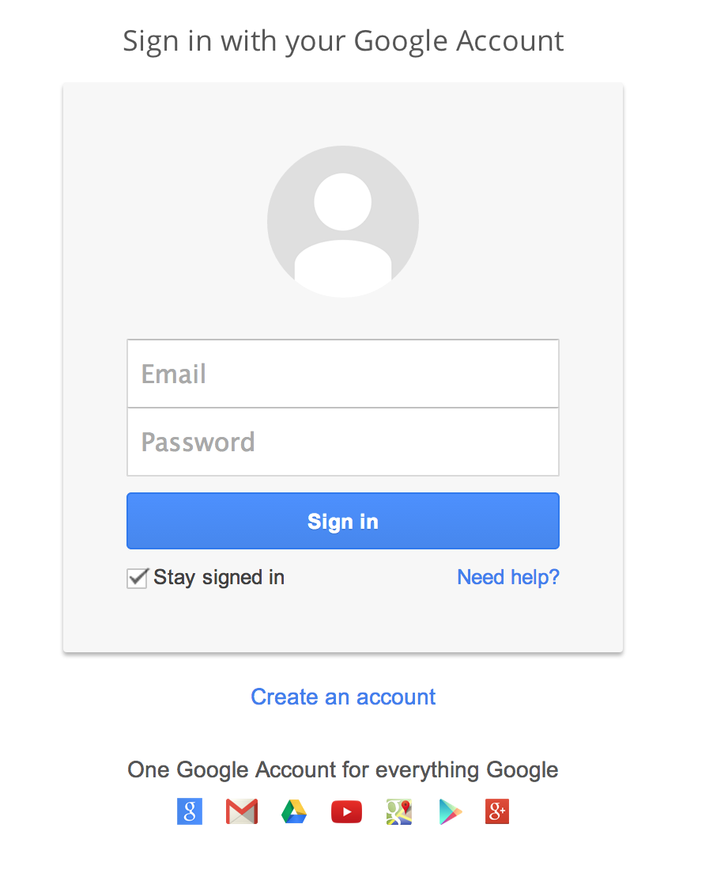
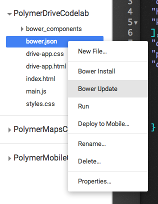
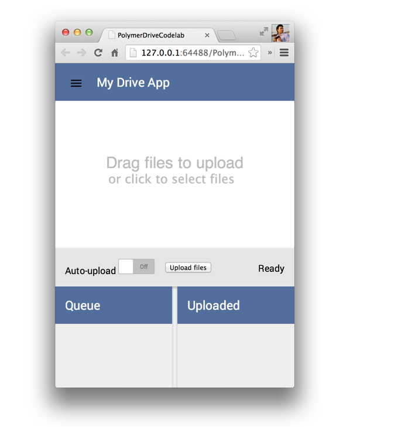
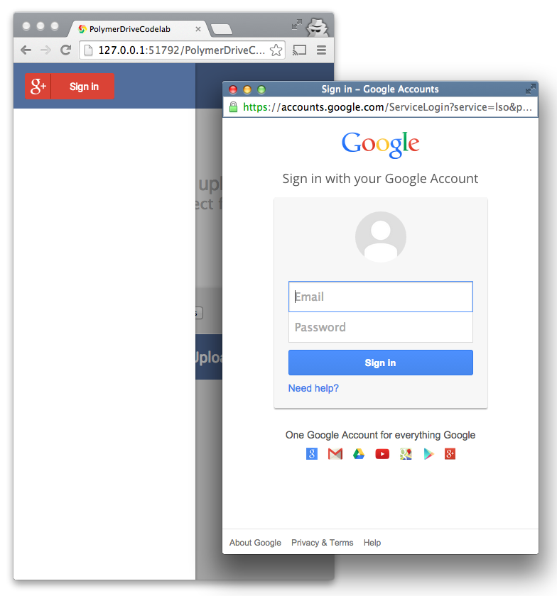
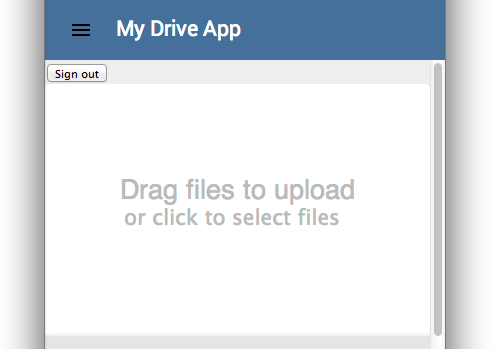
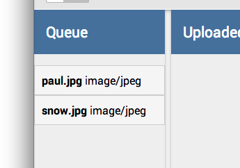
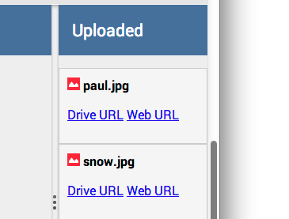
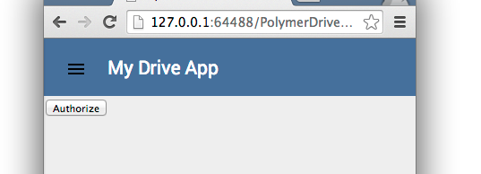
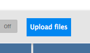
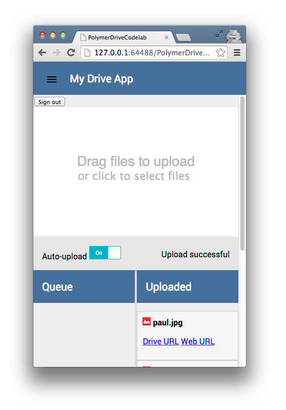

<toc-element></toc-element>

In this step you’ll add support for **authenticating** with a Google account. 

<figure>
  
  <figcaption>The Google authentication UI</figcaption>
</figure>

### Install &lt;google-signin>

To support authentication,
you can use an existing element called `<google-signin>`.
This element provides an authentication button and
all the machinery you need to authenticate with Google.

The element looks like this:

<figure>
  
  <figcaption>The UI of the &lt;google-signin> element</figcaption>
</figure>

So, let's add that element!

&rarr; Edit `bower.json` once again,
adding a reference to the "google-signin" element:

    "dependencies": {
      "polymer": "Polymer/polymer#master",
      "paper-elements": "Polymer/paper-elements#master",
      "core-splitter": "Polymer/core-splitter#master",
      "core-scaffold": "Polymer/core-scaffold#master",
      "cors-upload-sample": "googledrive/cors-upload-sample#master",
      "google-signin": "GoogleWebComponents/google-signin"
    }

  <ul>
    <li>In Chrome Dev Editor, right-click the filename **bower.json**.</li>
    <li>Run **Bower Update** from the dropdown.</li>
  </ul>
  

    
  

&rarr; Add an HTML import for `<google-signin>` to the top of
your `drive-app` implementation, along with your existing imports:

    <link rel="import" href="bower_components/google-signin/google-signin.html">

&rarr; Inside the `<template>` for the `drive-app` element,
add an instance of the `<google-signin>` element within
the first `<core-toolbar>`, replacing the existing contents:

    <google-signin></google-signin>

### Configure &lt;google-signin>

You need to configure the element a little further to pass in a valid
**clientId**, **scopes**, and some events that
the app can use to tell whether the user has signed in or signed out.

**Note:**

Replace the placeholder text marked "YOUR_CLIENT_ID_GOES_HERE" below with a
valid client ID. To get this, you must get your own developer API key from the
[Google Developer Console](https://console.developers.google.com/project).
Be sure to enable the Google Drive API and add
[http://127.0.0.1:51792/](http://127.0.0.1:51792/)
to the list of authorized clients (that's the ip and port that Chrome Dev Editor runs the app on. If you're using your own server, make sure the ip and port match on console.developers.google.com). In the **API's & auth > Consent screen** menu, be sure to give your application a `Product Name` and `Email Address`.
  
&rarr; Add attributes to the `google-signin` tag:

  <code><pre>
    &lt;google-signin         on-google-signin-success=&quot;{{signedIn}}&quot;         on-google-signed-out=&quot;{{signedOut}}&quot;         clientId=&quot;YOUR_CLIENT_ID_GOES_HERE&quot;         scopes="https://www.googleapis.com/auth/drive" &gt;     &lt;/google-signin&gt;
  </pre></code>

  <code><pre>
    &lt;google-signin         on-google-signin-success=&quot;{{signedIn}}&quot;         on-google-signed-out=&quot;{{signedOut}}&quot;         clientId=&quot;$IO_CLIENT_ID2_WEB_APPLICATION&quot;          scopes="https://www.googleapis.com/auth/drive" &gt;     &lt;/google-signin&gt;
  </pre></code>

The "[https://www.googleapis.com/auth/drive](https://www.googleapis.com/auth/drive)"
scope above ensures that when the user signs in,
they're prompted for permission to upload files to their Drive account.

### Hook up events

This `<google-signin>` element fires a unique set of events,
informing the user when they successfully authenticated and
are able to upload files to their Drive accounts.

The events that are of interest here are
"google-signin-success" and "google-signed-out".

&rarr; Add the following event handling functions to
the bottom of the JavaScript you wrote earlier inside of
the `drive-app` element:

    signedIn: function (e) {
      this.accessToken = e.detail.result.access_token;
      this.$.loggedin.style.display = 'block';
    },

    signedOut: function (e) {
      this.$.loggedin.style.display = 'none';
    }

### Run the app

You now have an application that looks like this:

<figure>
  
  <figcaption>The app's current UI</figcaption>
</figure>

It includes an Authorize button that, when clicked,
opens a window allowing the user to authenticate with Google Drive:

<figure>
  
  <figcaption>The authorize button</figcaption>
</figure>

The pop-up window looks like this:

<figure>
  
  <figcaption>The popup window</figcaption>
</figure>

When the user signs in, they are prompted to allow the app to
upload files to their Drive account. 

Dragging a file to the main window or
clicking the **click to select files** link adds the file to the queue. 

<figure>
  
  <figcaption>The file selection UI</figcaption>
</figure>

When the user selects files,
the **Queue** is populated with a list of files to be uploaded:

<figure>
  
  <figcaption>The Queue panel</figcaption>
</figure>

The user can then click the **Upload files** button to
upload the selected files to Drive.

<figure>
  
  <figcaption>The Upload files button</figcaption>
</figure>

If the uploads succeed,
they appear in the **Uploaded** panel with
both the name of the file and links to view it on the web.

<figure>
  
  <figcaption>The Uploaded panel</figcaption>
</figure>

Hooray. Our Google Drive app using Polymer is now fully functional. 

### Add some final styling

You’re almost at the finish line.
Now add some final styling to wrap up the app.

These final styling tweaks include making sure that
the signed in view is shown _only_ when a user is authenticated,
and that the app elements look as good as they can on small screens.

&rarr; Copy and paste the following styles into
the `<style>` tag for the `drive-app` element.

    .filelist {
      padding-left: 0px;
      list-style-type: none;
    }

    .filelist li {
      background: #F5F5F5;
      padding: 10px 10px;
      border: 1px solid #ccc
    }

    #loggedin {
      display: none;
      right: 0;
    }

    #dropzone-bar {
      right: 0;
      position: relative;
    }

    core-splitter {
      height: 500px;
    }

    .container {
      width: 400px;
      height: 500px;
    }

    #file-splitter {
      width: 100%;
      overflow: visible;
    }

    #upload {
      border: 1px solid rgba(0, 0, 0, 0);
      color: rgb(255, 255, 255);
      background-color: rgb(65, 132, 243);
      height: 36px;
      line-height:27px;
      font-size: 0.8em;
    }

    @media (max-width: 500px) {
      .panel { width: 100% }
    }

With these styles, the signed in view is now hidden until
the user is authenticated.
For signed-out users, the app looks like this:

<figure>
  
  <figcaption>The signed out UI</figcaption>
</figure>

These styles also include little, subtle fixes for
making the app look and behave better on devices with smaller screens.
For example, the **Upload files** button now has
a slightly larger touch target:

<figure>
  
  <figcaption>The restyled Upload files button</figcaption>
</figure>

Fantastic.

Also be sure to check out **Auto-upload** mode.
Toggle the button, select some files, and _whoooosh_—watch
the files go onto Drive!

<figure>
  
  <figcaption>Auto-upload mode</figcaption>
</figure>

### Summary

In this step you learned how to:

* Use `<google-signin>` to add authentication to the app
* Hook up sign-in so that the app shows upload capabilities only
when the user is signed in
* Optimize the mobile web app to look awesome
