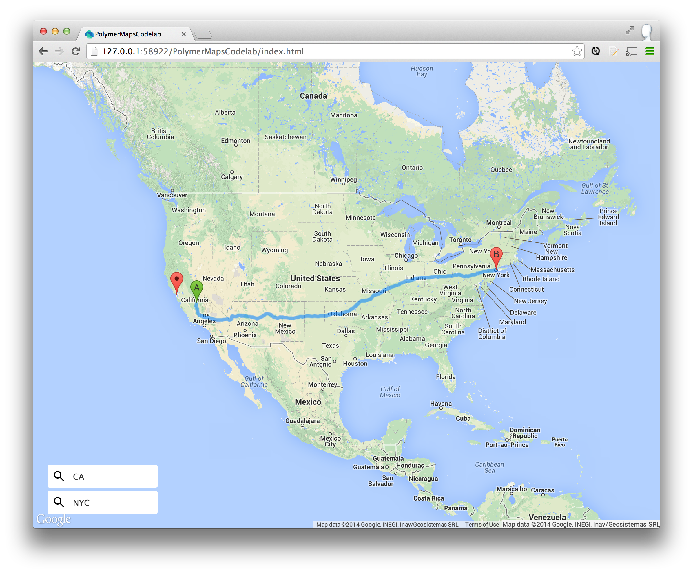

<toc-element></toc-element>

Polymer supports [two-way data binding](http://www.polymer-
project.org/docs/polymer/databinding.html). A useful way to use data binding is
to wire elements together using their attributes. This allows you to
declaratively share data between components and is often more convenient than
writing code.

### Add address inputs

Let's add input fields to allow users to input the start and end addresses.
Polymer provides several elements for working with input fields:
`core-field.html`, `core-icon.html`, and `core-icons.html`.

&rarr; In `index.html`, add three new HTML Imports for these components:

    <head>
      ...
      <link rel="import" href="bower_components/core-field/core-field.html">
      <link rel="import" href="bower_components/core-icon/core-icon.html">
      <link rel="import" href="bower_components/core-icons/core-icons.html">
    </head>

&rarr; In a container element with `id="inputs"`, declare two `<core-field>`
elements:

    

      <core-field></core-field>
      <core-field></core-field>
    

`<core-field>` accepts a `<core-icon>` and an `<input>`.

&rarr; Add a `<core-icon>` and an `<input>` to each `<core-field>`. Set the
`icon` attributes to **"icons:search"**:

    

      <core-field>
        <core-icon icon="icons:search"></core-icon>
        <input placeholder="Start address" value="San Francisco">
      </core-field>
      <core-field>
        <core-icon icon="icons:search"></core-icon>
        <input placeholder="End address" value="Mountain View">
      </core-field>
    

&rarr; In `styles.css`, add default styling so the input container appears in the lower left corner:

    #inputs {
      position: absolute;
      bottom: 25px;
      left: 25px;
      z-index: 100;
    }

    core-field {
      background: #fff;
      border-radius: 3px;
      margin-top: 5px;
      width: 200px;
    }

    core-field core-icon {
      vertical-align: middle;
    }

<figure>
  
  <figcaption>Address inputs</figcaption>
</figure>

### Use data-binding outside of Polymer

Polymer's data-binding features are only available when creating a
`<polymer-element>`. However, Polymer provides a
[type-extension](http://www.html5rocks.com/en/tutorials/webcomponents/customelements/#typeextension)
version of `<template>` named "auto-binding". It allows you to use `{{}}`
bindings outside of an element.

Properties defined on an auto-binding template are two-way data-bound. For
example:

    <template is="auto-binding">
      Hello, {{name}}. {{greeting}} <!-- Hello, Eric. How are you today? -->
    </template>

    

### Data-bind the map &#8596; directions element

In the last step, you wrote JavaScript to set the direction's `map` property:

    document.querySelector('google-map-directions').map = this.map;

Both maps and directions publish their `map` property as a
[published property](http://www.polymer-project.org/docs/polymer/polymer.html#published-properties).
This means you can use `{{}}` bindings on the `map` **attributes** to bind their
`map` **properties** together.

<aside class="callout">
  <b>What are published properties?</b>
  
<a href="http://www.polymer-project.org/docs/polymer/polymer.html#published-properties">Published
  properties</a> allow users to configure a property using an HTML attribute of
  the same name. Instead of setting a property in JS (for example,
  <code>myElement.foo = 'hi there'</code>), you can declare the attribute
  <code>&lt;my-element foo="hi there">&lt;/my-element></code>. Published
  properties are convenient to use because they support two-way data binding.

</aside>

&rarr; In `index.html`, remove the `<script src="main.js">` you added in Step 3.

&rarr; Wrap the existing markup in `<template is="auto-binding">`.

&rarr; Bind the `map` attribute of `<google-map>` to the `map` attribute of
`<google-map-directions>`. Make sure this is done inside
`<template is="auto-binding">`:

    <template is="auto-binding">
      <google-map map="{{map}}" ...></google-map>
      <google-map-directions map="{{map}}" ...></google-map-directions>
    </template>

**Note**: We've used `{{map}}` as the binding property name, but you can use
whatever name you like (for example, `{{foo}}`).

### Data-bind the address inputs &#8596; directions element

Right now, the `startAddress` and  `endAddress` attributes are hardcoded to
**"San Francisco"** and **"Mountain View"**, respectively.

    <google-map-directions startAddress="San Francisco"
                           endAddress="Mountain View"></google-map-directions>

Likewise, the address inputs are hardcoded:

    <input placeholder="Start address" value="San Francisco">
    <input placeholder="End address" value="Moutain View">

We can make things more dynamic by binding these inputs to
the attributes of the `<google-map-directions>` node.

&rarr; Bind the `<google-map-directions>` node's `startAddress` and
`endAddress` attributes to the `value` of the appropriate input:

    <template is="auto-binding">
      <google-map map="{{map}}" ...></google-map>
      <google-map-directions map="{{map}}"
                             startAddress="{{start}}"
                             endAddress="{{end}}">
      </google-map-directions>

      

        <core-field>
          <core-icon icon="icons:search"></core-icon>
          <input placeholder="Start address" value="{{start}}">
        </core-field>
        <core-field>
          <core-icon icon="icons:search"></core-icon>
          <input placeholder="End address" value="{{end}}">
        </core-field>
      

    </template>

The name you use in each `{{}}` doesn't matter, as long as the binding names
match for each pair of properties you want to bind together.

### Run the app

&rarr; Hit the  button.

<!-- (asolovay) Judging from the UI, they don't enter quote marks. -->
&rarr; Enter **CA** for the start address.

&rarr; Enter **NYC** for the end address.

You should see the map update itself with driving directions from
**California** to **New York**:

<figure>
  
  <figcaption>Data-bound inputs powering the driving directions</figcaption>
</figure>

Try entering other destinations! If something goes wrong, check that your markup
looks something like this:

    <body>

      <template is="auto-binding">

        <google-map map="{{map}}"
                    latitude="37.779" longitude="-122.3892"></google-map>
        <google-map-directions map="{{map}}"
                               startAddress="{{start}}"
                               endAddress="{{end}}">
        </google-map-directions>

        

          <core-field>
            <core-icon icon="icons:search"></core-icon>
            <input placeholder="Start address" value="{{start}}">
          </core-field>
          <core-field>
            <core-icon icon="icons:search"></core-icon>
            <input placeholder="End address" value="{{end}}">
          </core-field>
        

      </template>

    </body>

### Summary

Still no code!

In this step, you learned how to:

- Use the `<core-field>` and `<core-icon>` elements.
- Use use Polymer's two-way data binding features to bind to element attributes.
- Use data-binding outside of Polymer using `<template is="auto-binding">`.

### Next up

Allow users to select the type of directions (walking, transit, driving).
