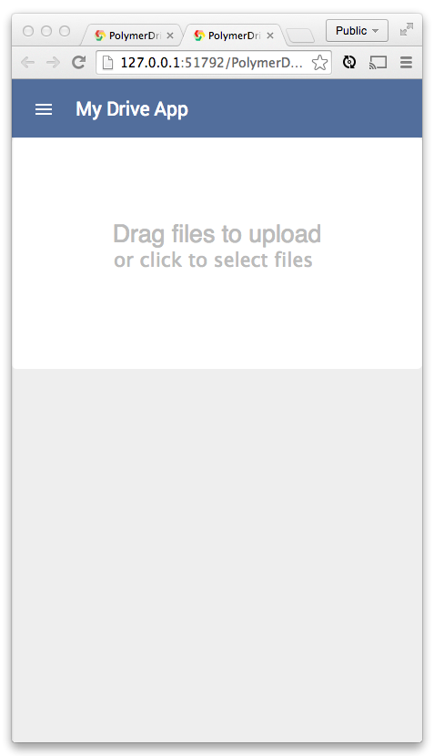

<toc-element></toc-element>

Users must be signed in to their Google account before
they can upload files to Google Drive.

This means that the app needs to show some UI before the user is signed in
and other UI after sign-in.

### Create a place for the signed-in UI

&rarr; Replace the "Content goes here..." placeholder div we saw in the last step
with a simple `
` element to contain the signed-in UI.

    

      ...
    

### Create a file selection area

The "loggedin" div needs an area where users can choose files to upload.
The user can drag and drop files if the app is on a desktop computer.
When the app is running on a mobile device,
the user must be able to tap a button to select files.

&rarr; Create a drop zone with a file selection button inside of the
"loggedin" `
`:

    

      

        Drag files to upload
        <input type="file" id="files" name="files[]" 
          on-change="{{handleFilePick}}" multiple>
      

    

When you select `index.html` and click  to preview the app, it should look like this:

<figure>
  
  <figcaption>The app's current UI</figcaption>
</figure>

Unfortunately, the app doesn't provide much space to drag and drop files
just yet. 

&rarr; Add the following code to `drive-app.css` to improve how the drag and drop area looks:

    #dropzone {
      -moz-border-radius: 5px;
      -webkit-border-radius: 5px;
      border-radius: 5px;
      padding: 90px 10px;
      text-align: center;
      font: 20pt bold 'Helvetica';
      color: #bbb;
      background: white;
    }
    
    #files {
      display: block;
      margin: 0 auto;;
    }
    
    #files::-webkit-file-upload-button {
      visibility: hidden;
    }
    
    #files::before {
      content: 'or click to select files';
      background: white;
      padding: 5px;
      outline: none;
      white-space: nowrap;
      -webkit-user-select: none;
      cursor: pointer;
      font-size: 16pt;
      margin: 0 auto;
    }
    
    #files:hover::before {
      border-color: black;
    }
    
    #files:active::before {
      background: -webkit-linear-gradient(top, #e3e3e3, #f9f9f9);
    }

The app should now look like this:

<figure>
  
  <figcaption>The app's current UI</figcaption>
</figure>

Don't worry yet about hooking up the events that
actually perform the upload and drag-drop logic.
You'll do that a little bit later.

### Add buttons to the toolbar

You may have noticed the `<core-toolbar>` element in our earlier scaffold.
Now let's reuse that element,
adding a second `<core-toolbar>` to the app. 

This toolbar will sit below the dropzone in the "loggedin" view.
It will be used for toggling whether the app should upload selected files
_automatically_ (as soon as each file is selected),
or only after the user clicks an Upload button.
All of the icons and content inside the toolbar should
flex to fit their layout.

You can use a few elements to achieve this UI.
Namely, you'll use some layout helpers that come with `polymer.html`,
and you'll use `<core-toolbar>` and `<paper-toggle-button>`.
You'll also add a label to the toolbar to
display the current upload status so the user knows what’s going on.

&rarr;  Add the following code directly after the closing `
` tag for our dropzone `
`:

    <core-toolbar layout horizontal id="dropzone-bar">
      

        Auto-upload
        <paper-toggle-button 
        checked="{{autoUpload}}">
        </paper-toggle-button>
      

      

        <button id="upload"
        on-click="{{manualUpload}}" 
        style="display:{{ autoUpload ? 'none' : 'inline-block' }}">
          Upload files
        </button>
      

      

      

        
Ready

      

    </core-toolbar>

&rarr; Add some styling for the toolbar, which again goes inside our `drive-app.css` file:

    #dropzone-bar {
      border-bottom:1px solid white;
      background: rgb(229, 229, 229);
      color: black;
      box-shadow: rgba(0, 0, 0, 0.298039) 0px 1px 8px;
      font-size: 1em;
    }

### Run the app

Select `index.html` and click the  button.
At this point you should see a fleshed out `<core-toolbar>`.
The app is slowly coming together! 

<figure>
  
  <figcaption>The app's current UI</figcaption>
</figure>

## Next up

Next, you'll add an area to display which files the user has uploaded.
