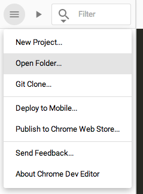

<toc-element></toc-element>

  <google-youtube
    videoid="uDw50BloI2Q"
    width="16"
    height="9"
    rel="0"
    autoplay="0"
    fluid>
  </google-youtube>

### 目標

このチュートリアルでは、簡単な Polymer アプリケーション（ソーシャル ネットワーキング サービス用のごく基本的なクライアント アプリケーション）を作っていきます。完成するとこのような感じになります。

<figure layout vertical center>
  
  <figcaption>
    スクリーンショットをクリックしてデモを表示
  </figcaption>
</figure>

盛りだくさんの内容ですので、早速、始めましょう。

### 新しいプロジェクトを作成する

<!-- Chrome Dev Editor callout block -->
<aside class="callout">
このcodelab では、Chrome アプリ IDE である **Chrome Dev Editor** を使用します。

  Run Chrome Dev Editor by clicking its icon at the bottom of your screen:
  <figure>
    
  </figure>

 Chrome Dev Editor をまだインストールしていない場合は、[Chrome ウェブストアからインストールしてください。](https://chrome.google.com/webstore/detail/spark/pnoffddplpippgcfjdhbmhkofpnaalpg).

</aside>
<!-- End of Chrome Dev Editor callout block -->

  <ul>
    <li>
      <a href="zips/PolymerApp.zip">プロジェクト ソースをダウンロード</a>して、自分のコンピューターに保存します。
    </li>
    <li>
      プロジェクト ファイルを解凍します。その中に `PolymerApp` というディレクトリがあります。
    </li>
  </ul>

  <ul>
    <li>
      Chrome Dev Editor にて、 をクリックして `Open Folder...` を選択します。
    </li>
  </ul>
  

    
  

  <ul>
    <li>
      `PolymerApp` ディレクトリを選択して、エディターにロードします。
    </li>
  </ul>
  

    
  

エディターのサイドバーに以下のような構造が表示されます。

    PolymerApp/
      api/          <!-- アプリが使用する架空の API -->
      components/   <!-- Bower からインストールした依存関係 -->
      images/
      post-service/ <!-- チュートリアルで使用するコンポーネント -->
      starter/      <!-- プロジェクトはここからスタートします -->
      step-2/       <!-- 各ステップのチェックポイント。参照用 -->
      step-3/
      step-4/
      step-5/
      .bowerrc      <!-- Bower の設定ファイル -->
      .gitignore
      bower.json    <!-- Bower のメタデータ ファイル。依存関係の管理に使用 -->

### アプリのプレビュー

&rarr; `starter/index.html` を開き、上部のツールバーにある  ボタンをクリックしてアプリを実行します。

Chrome Dev Editor がウェブ サーバーを起動し、`index.html` ページを開きます。変更を加えたときにその場で表示を確認できて、大変便利です。

<figure>
  
  <figcaption>index.html のプレビュー</figcaption>
</figure>

表示されるのはグレーの背景だけですが、少なくともサーバーが動いていること、作業を始める準備が整ったことがこれで分かります。

### まとめ

このステップで学んだ内容:

- プロジェクトをChrome Dev Editor へロードする方法
- Chrome Dev Editor のウェブ サーバーを起動してアプリをプレビューする方法

### 次のステップ

今の時点ではアプリはまだ何もできません。少しコードを追加してみましょう！
