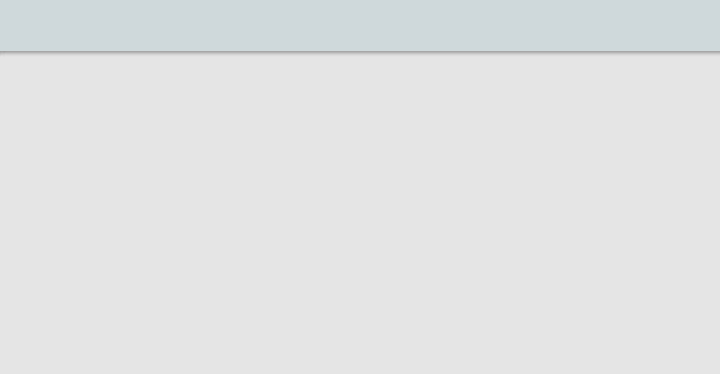
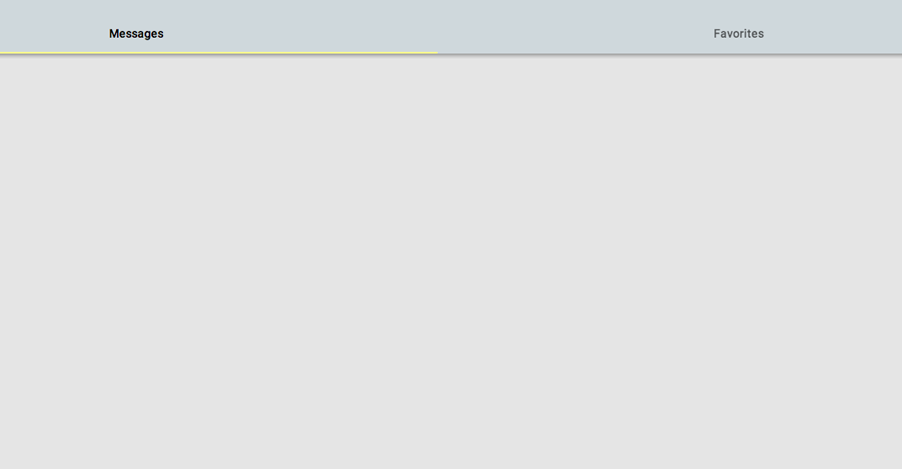
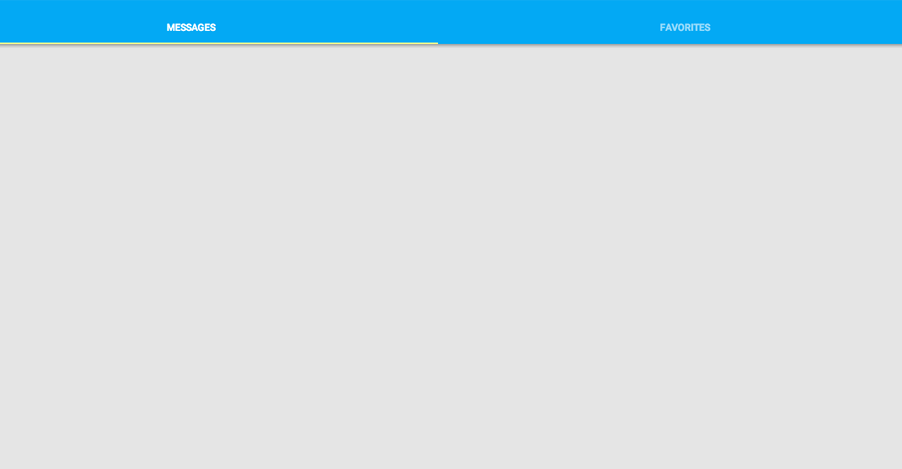

<toc-element></toc-element>

このステップでは、あらかじめ用意されている Polymer 要素の一部を使って、ツールバーとタブを持つ基本的なアプリケーション構造を作成します。

このステップで学ぶ内容:

-   HTML Imports を使用する
-   標準的な HTML、CSS、JavaScript で Polymer 要素を使用する

<div class="yt-embed">
  <google-youtube
    videoid="QoarDun5arg"
    width="16"
    height="9"
    rel="0"
    autoplay="0"
    fluid>
  </google-youtube>
</div>

### 依存関係をインポートする

`starter` ディレクトリから `index.html` ファイルを開きます。出発点となるこのファイルは、以下のような内容です。

```side-by-side
<!doctype html>
<html>

<head>

  <title>unquote</title>

  <meta name="viewport"
  content="width=device-width, minimum-scale=1.0, initial-scale=1.0, user-scalable=yes">
  
  <link rel="stylesheet" href="app.css">
  
  <script src="../components/webcomponentsjs/webcomponents.js">
  </script>
  
  <link rel="import"
    href="../components/font-roboto/roboto.html">
  ...
```

<ul class="side-by-side">
  <li>必要最低限のものが備わったこのファイルは、一部のスタイルの定義および <code>webcomponents.js</code> スクリプトの埋め込みを行うもので、足りない Web Components 機能を提供してくれます。</li>
  <li><code>link rel="import"</code> 要素は <em>HTML Import</em> というもので、リソースをHTMLファイルに取り込む新しい方法です。</li>
</ul>

<aside class="callout">
  <b>注:</b>

<p>`font-roboto` インポートは、[Google Fonts API](https://developers.google.com/fonts/) を使って `RobotoDraft` フォントをロードします。オフラインで作業している場合、または何らかの理由で Google Fonts API にアクセスできない場合は、これによってウェブ ページの描画がブロックされることがあります。この問題が生じたときは、`font-roboto` のインポートをコメントアウトしてください。</p>
</aside>

ファイルの最後に、何か新しいものがありますね。

```side-by-side
<body unresolved>

  <script src="app.js"></script>
</body>
```

<ul class="side-by-side">
  <li><code>&lt;body></code> 要素の <code>unresolved</code> 属性は、カスタム要素をネイティブ サポートしていないブラウザでのFOUC（flash of unstyled content）を防ぐためのものです。詳しくは、<a href="//polymer-project.org/docs/polymer/styling.html#fouc-prevention">Polymer のスタイルに関するドキュメント</a> を参照してください。</li>
</ul>

<hr>

さて、いよいよコードを書いてみましょう。

<div class="yt-embed">
  <google-youtube
    videoid="-TwIxg39szQ"
    width="16"
    height="9"
    rel="0"
    autoplay="0"
    fluid>
  </google-youtube>
</div>

&rarr; HTML import リンクを追加して、`<core-header-panel>`、`<core-toolbar>`、および`<paper-tabs>` 要素を追加します。

```side-by-side
<script src="../components/webcomponentsjs/webcomponents.js">
</script>

<link rel="import" 
  href="../components/font-roboto/roboto.html">

<!-- インポートをここに追加: -->
<link rel="import"
  href="../components/core-header-panel/core-header-panel.html">
<link rel="import"
  href="../components/core-toolbar/core-toolbar.html">
<link rel="import"
  href="../components/paper-tabs/paper-tabs.html">
```

<ul class="side-by-side">
  <li>Polymer は <a href="//polymer-project.org/platform/html-imports.html">HTML imports</a> を使ってコンポーネントをロードします。HTML imports によって依存関係が管理され、要素とその依存関係のすべてが使用前に確実にロードされます。</li>
</ul>

<hr>

### ツールバーを追加する

<div class="stepbystep">
  <ul>
    <li>
      `<body>` タグの中に、以下のコードを追加します。
    </li>
  </ul>
</div>

```side-by-side
<core-header-panel>

  <core-toolbar>
  </core-toolbar>

  <!-- メインページのコンテンツがここに入る --> 

</core-header-panel>
```

<ul class="side-by-side">
  <li>
      <code><a href="//polymer-project.org/docs/elements/core-elements.html#core-header-panel">&lt;core-header-panel&gt;</a></code> 要素はシンプルなコンテナで、ヘッダー（ここでは<code>&lt;core-toolbar></code> 要素）と、コンテンツの一部が入ります。デフォルトでは、ヘッダーは画面上部に固定されますが、コンテンツと一緒にスクロールするように設定することもできます。</li>
  <li><code><a href="//polymer-project.org/docs/elements/core-elements.html#core-toolbar">&lt;core-toolbar></a></code> 要素は、タブ、メニューボタン、その他のコントロールのコンテナとして機能します。</li>
</ul>

ここで  ボタンをクリックしてアプリをプレビューしようとすると、ページは空白になります。それは、`<core-header-panel>` には必ず高さを明示的に設定する必要があるためです。これを簡単に設定するには、[レイアウト属性](//polymer-project.org/docs/polymer/layout-attrs.html) を使用します。

<div class="stepbystep">
  <ul>
    <li>
      `fullbleed`、`layout`、`vertical` 属性を `<body>` に追加します。
    </li>
    <li>
      `flex` 属性を `<core-header-panel>` に追加します。
    </li>
  </ul>
</div>

コードは次のようになります。

```side-by-side
<body unresolved fullbleed layout vertical>
  <core-header-panel flex>
  
    <core-toolbar>
    </core-toolbar>
  
    <!-- メインページのコンテンツがここに入る --> 
  
  </core-header-panel>

  <script src="app.js"></script>
</body>
```

<ul class="side-by-side">
  <li><code>fullbleed</code> 属性にすると、<code>&lt;body></code> がビューポートいっぱいに広がり、縁周辺のマージンとパディングはすべてなくなります。</li>
  <li>
    コンテナに <code>layout</code> 属性を加えると、フレックス コンテナにすることができます。<code>horizontal</code> または <code>vertical</code> を指定すれば向きを変更できます。
  </li>
  <li>
  <code>layout</code> 属性を使用している要素の子は、<code>flex</code> 属性を使って自身のサイズを制御できます。<code>flex</code> 属性は、子に対し、可能な限り大きなスペースを取るよう指示します。
  </li>
</ul>

 をもう一度クリックするか、ページを再読み込みすると、画面上にグレーのツールバーが表示されます。できましたね！

<figure>
  
  <figcaption>最初の `<core-header-panel>`</figcaption>
</figure>

<hr>

#### タブを追加する

<div class="yt-embed">
  <google-youtube
    videoid="ffwXhCvThCk"
    width="16"
    height="9"
    rel="0"
    autoplay="0"
    fluid>
  </google-youtube>
</div>

このアプリケーションでは、すべてのメッセージ一覧とお気に入り一覧という 2 種類のビューの切り替えにタブを使用します。<code><a href="//polymer-project.org/docs/elements/paper-elements.html#paper-tabs">&lt;paper-tabs&gt;</a></code> 要素は `<select>` 要素のような働きをしますが、タブのセットというスタイルになっています。ここでもレイアウト属性を使用して、タブを `<core-toolbar>` の中に配置します。

&rarr; 以下の `<paper-tabs>` コードを追加します。

```side-by-side
<core-toolbar>

  <!-- 以下のコードを追加 -->
  <paper-tabs selected="messages" flex>
    <paper-tab name="messages">Messages</paper-tab>
    <paper-tab name="favorites">Favorites</paper-tab>
  </paper-tabs>

</core-toolbar>
```

<ul class="side-by-side">
  <li>
    <code>&lt;paper-tabs></code> は、名前の値またはインデックスの値によって、選択されている子を識別します。
  </li>
  <li>
    <code>selected="messages"</code> は、一番目のタブを初期選択タブとして選択します。
  </li>
  <li>
    ここでは、子は <code>&lt;paper-tab></code> 要素で、これによってスタイルや、タブに触れたときに「インクが波のように広がる」アニメーションが提供されます。
  </li>
  <li>
    `<core-toolbar>` は flexbox を使って子の位置を決めますので、`flex` 属性を使い、`<paper-tabs>` に対し、可能な限り大きなスペースを取るよう指示します。
  </li>
</ul>

ページを再読み込みすると、タブがツールバーの中央に表示された状態となります。ツールバーの下の方に「ピン止め」するには、<code>fit</code> クラスを設定します。

&rarr; `fit` クラスを `<paper-tabs>` 要素に追加します

```side-by-side
<paper-tabs class="fit" selected="messages" flex>
  <paper-tab name="messages">Messages</paper-tab>
  <paper-tab name="favorites">Favorites</paper-tab>
</paper-tabs>
```

<ul class="side-by-side">
  <li>`<core-toolbar>` には、`fit` 以外にも、子の整列位置を変更できるクラスがいくつか用意されています。<a href="http://www.polymer-project.org/docs/elements/core-elements.html#core-toolbar"> `<core-toolbar>` ドキュメントを参照してください</a>。</li>
</ul>

 をもう一度クリックするか、ページを再読み込みしてください。今度はタブがツールバーの下の方に表示されているはずです。

<figure>
  
  <figcaption>いい感じの`<paper-tabs>` です</figcaption>
</figure>

<hr>

#### 新しい要素にスタイルを追加する

<div class="stepbystep">
  <ul>
    <li>
      `app.css` を開いて、`/* Add your styles here! （ここにスタイルを追加）*/` と書かれた行を探します。 
    </li>
    <li>
      以下のように CSS ルールを追加します
    </li>
  </ul>
</div>

```
/* Add your styles here!（ここにスタイルを追加） */
core-toolbar {
  background: #03a9f4;
  color: white;
}
paper-tabs {
  text-transform: uppercase;
}
```

&rarr; `app.js` を開き、以下のように、タブ切り替えイベントを扱うコードを追加します。

```side-by-side
var tabs = document.querySelector('paper-tabs');

tabs.addEventListener('core-select', function() {
  console.log("Selected: " + tabs.selected);
});
```

<ul class="side-by-side">
  <li>
     <code>&lt;paper-tabs></code> 要素は、タブが選択されると<code>core-select</code> イベントを起動します。この要素は、あらかじめ組み込まれている要素と同じように扱うことができます。
  </li> 
  <li>
    今はまだ切り替える内容がありません。後ほど追加して仕上げましょう。
  </li>
</ul>


### アプリを実行する

 をまだクリックしていなければ、クリックしてください。Polymer アプリができました！

<figure>
  
</figure>

<aside class="callout">
  <b>注:</b>

  <p>コンソールを開いている場合は、タブを切り替えるたびに 2 つの `core-select` イベントが発生していることに気が付くでしょう。1 つは元々選択していたタブのイベント、1 つは新たに選択したタブのイベントです。`<paper-tabs>` 要素はこの挙動を<code><a href="//polymer-project.org/docs/elements/core-elements.html#core-selector">&lt;core-selector&gt;</a></code> から引き継いでいて、単一選択と複数選択の両方をサポートしています。</p>
</aside>

うまくいかない場合は、`step-2` フォルダー内にある以下のファイルと自分のコードとを照らし合わせてみてください。

-   [`index.html`](https://github.com/robdodson/its-hackademic/blob/master/static/codelabs/1-polymer-first-app/PolymerApp/step-2/index.html)
-   [`app.css`](https://github.com/robdodson/its-hackademic/blob/master/static/codelabs/1-polymer-first-app/PolymerApp/step-2/app.css)
-   [`app.js`](https://github.com/robdodson/its-hackademic/blob/master/static/codelabs/1-polymer-first-app/PolymerApp/step-2/app.js)

### まとめ

このステップで学んだ内容:

- HTML imports を使ってカスタム要素をインポートする
- カスタム要素を使ってシンプルなアプリのレイアウトを作成する
- CSS を使ってカスタム要素のスタイルを設定する

<aside class="callout">
  <b>さらに試してみる:</b>

  <p>`<paper-tabs>`内で別の子を使用できますか？ 画像やテキスト スパンを試してみてください。</p>
</aside>

### 次のステップ

独自の要素を作成します。
