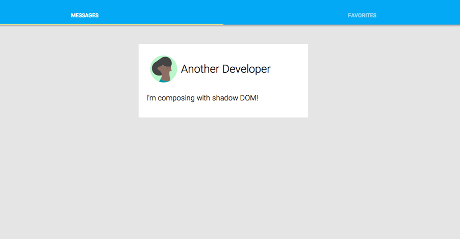

<toc-element></toc-element>

さて、アプリケーションの基本構造ができあがりましたので、投稿を表示させるカード要素の作成を始めましょう。最終的にはプロフィール画像用のスペース、名前、お気に入りボタン、コンテンツ領域があるカードになります。

<div layout vertical center>
  
</div>

このステップでは、`<post-card>` 要素を作成します。`<post-card>` 要素は、自身の子のレイアウトとスタイルを制御する要素ですので、以下のようなシンプルなマークアップで、上のようなカードを作成できます。
 
    <post-card>
      
      <h2>A. Developer</h2>
      <p>コードについて何か特に言いたいこと</p>
    </post-card>

このステップで学ぶ内容:

-   Polymer を使ってカスタム要素を作成する
-   shadow DOM を使う

<aside class="callout">
  <b>さらに学ぶ:</b>

  <p>Shadow DOM は、DOM 要素内にローカルな DOM ツリーを追加する方法を提供するもので、DOM ツリーには、ウェブページの残りの部分から切り離されたローカルなスタイルとマークアップとを持たせることができます。</p>
  <p>Shadow DOM について詳しくは、<a href="//polymer-project.org/platform/shadow-dom.html"> Shadow DOM ポリフィルに関するドキュメント</a>を参照してください。</p>
</aside>

### `<post-card>` 要素を作成する

<div class="yt-embed">
  <google-youtube
    videoid="HVDsd-7SDOI"
    width="16"
    height="9"
    rel="0"
    autoplay="0"
    fluid>
  </google-youtube>
</div>

エディターで `post-card.html` を開きます。このファイルには、カスタム要素のスケルトンが含まれており、インポートで始まっています。

```side-by-side
<link rel="import" 
  href="../components/polymer/polymer.html">
<link rel="import" 
  href="../components/core-icon-button/core-icon-button.html">
...
```

<ul class="side-by-side">
  <li>前のステップと同様に、<code>&lt;link rel="import"&gt;</code>を使い、<code>post-card</code> 要素が依存している要素をインポートします。</li>
</ul>

次は、要素そのものの定義です。

```side-by-side
<polymer-element name="post-card">
  <template>
    <style>
    :host {
      display: block;
      position: relative;
      background-color: white;
      padding: 20px;
      width: 100%;
      font-size: 1.2rem;
      font-weight: 300;
    }
    .card-header {
      margin-bottom: 10px;
    }
    </style>

    <!-- CARD CONTENTS GO HERE（カードのコンテンツがここに入る） -->
  </template>
  ...
```

<ul class="side-by-side">
  <li><code>&lt;polymer-element&gt;</code> 要素は、Polymer において新しいカスタム要素をどのように定義するかを示します。ここでは、「post-card」という要素を作成します。</li>
<li><code>&lt;template&gt;</code> は要素の内部の DOM 構造、つまり <em>shadow DOM</em> を定義します。ここに、カスタム要素のマークアップを追加します。</li>
<li><code>:host</code> 擬似クラスは、shadow DOM ツリー内部で使用され、そのツリーを<em>ホスト</em>する要素にマッチ します。 ここでは、 <code>&lt;post-card&gt;</code> 要素にマッチします。</li>
<li>shadow DOM 内部で使用される通常のセレクターは、shadow DOM へ <em>スコープ</em>されます。 ここでは、<code>.card-header</code> は、この要素のshadow DOM にある要素にしかマッチしません。</li>
</ul>

<aside class="callout">
  <b>注:</b>

  <p>`<polymer-element>` タグには、_直下の_子孫として `<template>` タグを 1つしか入れることができません。このタグはその要素のshadow DOM を定義します。それ以外の `<template>` タグは、外のテンプレート タグの中にネストしても構いません。</p>
</aside>

要素の定義の最後にあるのが `<script>` タグです。

```side-by-side
  <script>
  Polymer({
    // 要素のプロパティとメソッドがここに入る
  });
  </script>
</polymer-element>
```

<ul class="side-by-side">
<li>ファイルの最後にある <code>Polymer</code> コールは要素を<em>登録</em>するもので、ブラウザによって認識されます。これについては、後のステップで詳しく扱います。</li>
</ul>

<aside class="callout">
  <b>注:</b>

  <p>
    一般的には、スタイルとスクリプトは外部ファイルに入れておくのが良いとされているので、この例でなぜ `<style>` と`<script>` タグを使用しているのか、不思議に思うかもしれません。
  </p>
  <p>
    それは、Shadow DOM は CSS を要素インスタンスにスコープしますので、 残りのマークアップと同じファイルにある方が、都合がよいためです。同様に、この例の JavaScript は、要素のプロトタイプ用のみです。`<style>` と `<script>` タグを使用するのは必須というわけではなく、外部ファイルを使用したい場合は使用して構いません。このチュートリアルでは、単に便宜上、この方法を採用しています。
  </p>
</aside>

<hr>

#### カード構造を作成する

<div class="yt-embed">
  <google-youtube
    videoid="wZ1dNGRdA5E"
    width="16"
    height="9"
    rel="0"
    autoplay="0"
    fluid>
  </google-youtube>
</div>

<code>&lt;post-card&gt;</code> のインスタンスを作成するとき、そのshadow DOM <code>&lt;template&gt;</code> のコンテンツは、要素の <em>shadow root</em>として挿入されます。これらの要素はブラウザでレンダリングされますが、要素の <code>children</code> コレクションの中には含まれません。

デフォルトでは、ユーザーが追加した子はいずれもレンダリングされません。例えば、<pre>&lt;post-card&gt;&lt;h3&gt;Hello!&lt;/h3&gt;&lt;/post-card&gt;</pre>

これは、単一の<code>&lt;h3&gt;</code>要素を子に持つ <code>&lt;post-card&gt;</code> を作成します。
<code>&lt;post-card&gt;</code> の中で <code>&lt;h3&gt;</code> をレンダリングするには、<em>挿入ポイント</em> を追加する必要があり、ブラウザに対して、shadow DOM ツリーのどこにレンダリングするのかを指示する必要があります。

&rarr; `CARD CONTENTS GO HERE（カードのコンテンツがここに入る）` コメントを探し、そのコメントを以下の様に `<div>` と `<content>` タグで置き換えます。

```side-by-side
<!-- 以下のコードを追加: -->
<div class="card-header" layout horizontal center>
  <content select="img"></content>
  <content select="h2"></content>
</div>
<content></content>
```

<ul class="side-by-side">
  <li>`layout horizontal center` は、フレックスボックス レイアウトを作成し、子は横方向に整列され、縦にセンタリングされた状態となります。</li>
  <li>3 つの <code>&lt;content&gt;</code> 要素は、<em>挿入ポイント</em>を作成します。 <br />
（shadow DOM 仕様では、ノードを選択するこのプロセスを<em>distribution（分散）</em>と呼びます。）</li>
  <li>子である<code>&lt;img&gt;</code> はすべて、最初の <code>&lt;content&gt;</code> タグにマッチし、ここに挿入されます。</li>
  <li>二番目の <code>&lt;content&gt;</code> タグは、子である<code>h2</code>のすべてを選択します。</li>
  <li>最後の<code>&lt;content&gt;</code> タグ（<code>select</code>  属性なし）は、まだ挿入されていないすべてのノードを選択します。（おそらくこれが <code>&lt;content&gt;</code> 要素の最も一般的な形です。)</li>
</ul>

<aside class="callout">
  <b>コンテンツの選択:</b>

  <p>`content` 要素の `select` 属性には、[限られた一部の CSS セレクター](http://w3c.github.io/webcomponents/spec/shadow/#satisfying-matching-criteria) を使用できます。選択できるのはホストノードの直下の子だけで、子孫は選択できません。</p>
</aside>

<hr>

#### インポートしたコンテンツのスタイルを設定する

使用できる新しい CSS セレクターがいくつかあります。すでに説明したように、最上位レベルの `<post-card>` 要素のスタイル設定用に、`post-card.html` ファイルにはすでに `:host` セレクターが含まれています。

`<content>` 要素を使って追加した子のスタイルを設定するには、`<style>` タグの中で、既存のルールの後に以下の CSS を追加します。

```side-by-side
.card-header {
  margin-bottom: 10px;
}
/* スタイルをここに追加: */
.card-header ::content h2 {
  margin: 0;
  font-size: 1.8rem;
  font-weight: 300;
}
.card-header ::content img {
  width: 70px;
  border-radius: 50%;
  margin: 10px;
}
</style>
```

<ul class="side-by-side">
  <li>擬似要素の <code>::content</code> は挿入ポイントを選択します（<code>&lt;content&gt;</code> タグで作成した挿入ポイント）。
ここでは、<code>::content h2</code> は、挿入ポイントを通って分散されたすべての<code>h2</code> を選択します。
.</li>
</ul>

<aside class="callout">
  <b>注:</b>

  <p>挿入ポイント自体のスタイル設定はできませんので、擬似要素<code>::content</code> は常に子孫セレクターと共に使用します。</p>
</aside>

### `<post-card>` をアプリにインポートする

<div class="stepbystep">
  <ul>
    <li>`post-card.html` ファイルを保存し、エディターで `index.html` を開きます。</li>
    <li>既存のインポートの後に `post-card.html` のインポートを追加します。</li>
  </ul>
</div>

```side-by-side
<link rel="import"
  href="../components/paper-tabs/paper-tabs.html">
<!-- 以下のインポートを追加: -->
<link rel="import" href="post-card.html">
```

<ul class="side-by-side">
  <li>これで、<code>&lt;post-card&gt;</code> 要素が <code>index.html</code>で使用できるようになります。</li>
</ul>

<hr>

&rarr; `<post-card>` 要素を、`index.html` の `<core-toolbar>` 要素のすぐ後ろに追加します。

```side-by-side
<!-- 以下のコードを追加: -->
<div class="container" layout vertical center>

  <post-card>
    
    <h2>Another Developer</h2>
    <p>I'm composing with shadow DOM!</p>
  </post-card>
  
</div>
```

<ul class="side-by-side">
  <li>ここで指定する子要素は、<code>&lt;post-card&gt;</code> 要素の挿入ポイントへ<em>分散</em>されます。</li>
</ul>

### アプリを実行する

`index.html` が開いていることを確認し、 ボタンをクリックします。アプリケーションは以下のように表示されるはずです。

<div layout vertical center>
  
</div>

お気に入りボタンがまだない状態ですが、だんだんそれらしくなってきました。

うまくいかない場合は、`step-3` フォルダー内にある以下のファイルと自分のコードとを照らし合わせてみてください。

-   [`post-card.html`](https://github.com/robdodson/its-hackademic/blob/master/static/codelabs/1-polymer-first-app/PolymerApp/step-3/post-card.html)
-   [`index.html`](https://github.com/robdodson/its-hackademic/blob/master/static/codelabs/1-polymer-first-app/PolymerApp/step-3/index.html)

<aside class="callout">
  <b>さらに試してみる:</b>

  <p>挿入ポイントを色々と触ってみて、どんなふうになるのか体験してみてください。
`index.html` にて `<post-card>` の子の順序を変えた場合、何か変化するでしょうか？ 複数の画像、あるいはプレーン テキストを追加するとどうなるでしょうか？ また、 `post-card.html` にて 2 つの `select=` 属性を入れ替えるなど、試してみてください。</p>
</aside>

### まとめ

このステップで学んだ内容:

- Polymer を使ってカスタム要素を作成する
- shadow DOM を使う

### 次のステップ

データ バインディングを使います。
