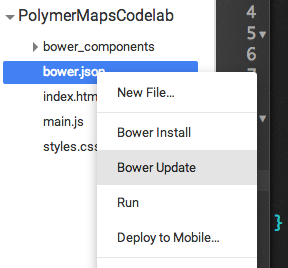
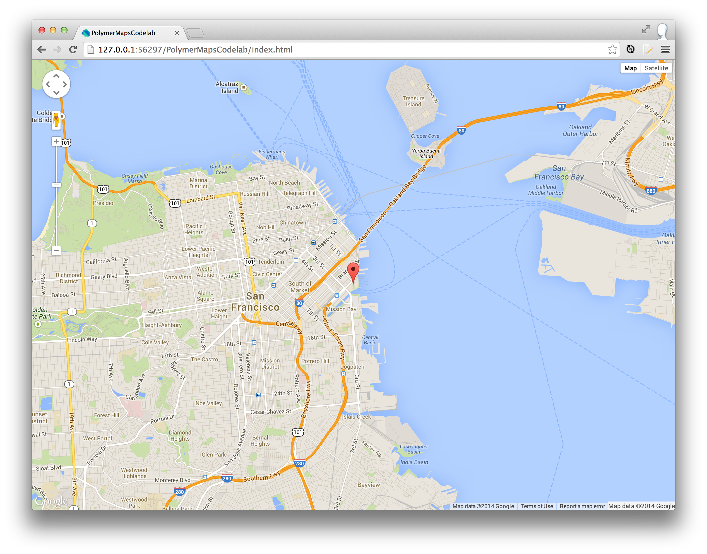

<toc-element></toc-element>

Polymer は、Google Map表示用に`<google-map>`要素([github](https://github.com/GoogleWebComponents/google-map))を提供しています。この要素を使うには、まず、Bower を使って要素をインストールする必要があります。

<aside class="callout">
  <b>Bower とは？</b>

  
<a href="http://bower.io/">Bower</a> は、クライアント側のパッケージ管理ツールで、どんなウェブ アプリでも使用することができます。Polymer と連携して、面倒な依存関係管理を簡素化します。どのコンポーネントもみな、自身の依存関係を定義しています。Bower を使ってコンポーネントをインストールすると、そのコンポーネントの依存関係も同時に <code>bower_components/</code> の中にインストールされます。

</aside>

### &lt;google-map> 要素をインストールする

通常は、`bower install GoogleWebComponents/google-map --save` をコマンドライン上で実行して `<google-map>` をインストールしますが、Chrome Dev Editor には Bower コマンドを実行するコマンドラインがありません。代わりに、手動で `bower.json` を編集して `google-map` を追加したのち、Chrome Dev Editor の **Bower Update** 機能を実行します。**Bower Update** は、`bower.json` にある依存関係をチェックし、抜けているものがあればそれをインストールします。

<!-- <aside class="callout">
  
<b>Pro tip</b>: the <code>--save</code> option appends the item to the <code>dependencies</code> section in <code>bower.json</code>.

</aside> -->

&rarr; `bower.json` を編集し、`google-map` を `dependencies` オブジェクトに追加します。

    "dependencies": {
      "polymer": "Polymer/polymer#master",
      "paper-elements": "Polymer/paper-elements#master",
      "google-map": "GoogleWebComponents/google-map#master"
    }

  <ul>
    <li>エディターにて、ファイル名 `bower.json` の上で右クリックします。</li>
    <li>コンテキスト メニューから <b>Bower Update</b>（Bower 更新）を選択します。</li>
  </ul>
  

    
  

ダウンロード時間はおそらく数秒です。`<google-map>`（および依存関係）がインストールされたかどうかは、`bower_components/google-map/` が作成されてそこにデータが入っているかで確認できます。

### &lt;google-map> 要素を使用する

`<google-map>` を使用するには、以下の手順を実施する必要があります。

1. HTML Import を使って `<google-map>` を `index.html` にロードする
2. ページ上で要素のインスタンスを宣言する

&rarr; `index.html` の `<head>` に、`google-map.html` をロードする [HTML Import](http://www.polymer-project.org/platform/html-imports.html) を追加します。

**重要**: ポリフィルが正しくインポートをロードできるよう、すべてのインポートは `webcomponents.js` の後に置きます。

    <head>
      ...
      
      <link rel="import" href="bower_components/google-map/google-map.html">
    </head>

<aside class="callout">
  <b>注:</b>
  
このプロジェクトの土台 には、`<head>` の中にすでにいくつかのHTML Imports が入っています。それらが邪魔になるようでしたら削除しても構いません。何かを表示できるようそこに入れているだけで、このチュートリアルでは必要ありません。

</aside>

&rarr; `<body>` のコンテンツを削除して、`<google-map>` 要素を以下のように宣言します。

    <body>
      <google-map latitude="37.779" longitude="-122.3892" zoom="13"></google-map>
    </body>

お分かりのように、`<google-map>` の使用方法は完全に宣言型です。地図は、`latitude`（緯度）および `longitude`（経度）属性を使って中央に配置され、`zoom`（ズーム）属性でそのズーム レベルが決まります。

#### 地図のスタイルを設定する

この時点でアプリを実行しても何も表示されません。地図を正しく表示させるには、CSS にて `display: block` に設定して、`height`（高さ）を与える必要があります。

&rarr; `styles.css` を開き、その内容を以下のようにデフォルトのスタイル設定で置き換えます。

    body, html {
      font-family: 'Roboto', Arial, sans-serif;
      height: 100%;
      margin: 0;
    }
    google-map {
      display: block;
      height: 100%;
    }

#### マーカーを追加する

`<google-map>`は、`<google-map-marker>` 要素を子として宣言することによって、マーカーに対応します。マーカーの位置も `latitude`（緯度）および `longitude`（経度）属性を使って設定します。

&rarr; `index.html` に戻り、`<google-map-marker>` を地図に追加します。

    <google-map
        latitude="37.779"
        longitude="-122.3892"
        disableDefaultUI>
      <google-map-marker
          latitude="37.779"
          longitude="-122.3892"
          title="Go Giants!"
          draggable="true"></google-map-marker>
    </google-map>

### アプリを実行する

  
  <figcaption>地図とマーカーが表示された index.html </figcaption>
</figure>

### まとめ

このステップで学んだ内容:

- Bower を使って `<google-map>` 要素をインストールする
- この要素を使い、宣言的にマーカーを設置する
- CSS を使ってカスタム要素のスタイルを設定する

### 次のステップ

ドライブ ルート案内を追加します。
