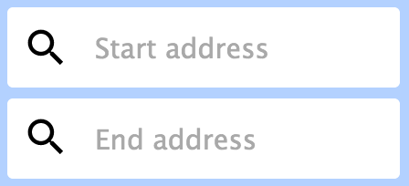

<toc-element></toc-element>

Polymer は[双方向のデータ バインディング](http://www.polymer-
project.org/docs/polymer/databinding.html) をサポートしています。データ バインディングが便利なのは、要素同士を、それらの属性を使ってつなげることができる点です。これによって、コンポーネント間のデータ共有を宣言的に行うことができ、多くの場合、コードを書くよりも便利です。

### アドレス入力を追加する

入力フィールドを追加して、ユーザーが出発地アドレスと目的地アドレスを入力できるようにしましょう。Polymer では、入力フィールドと連携する要素がいくつか用意されています。`core-field.html`、`core-icon.html`、`core-icons.html` がそうです。

&rarr; `index.html` にて、これらのコンポーネント用の 3 つのHTML Imports を新たに追加します。

    <head>
      ...
      <link rel="import" href="bower_components/core-field/core-field.html">
      <link rel="import" href="bower_components/core-icon/core-icon.html">
      <link rel="import" href="bower_components/core-icons/core-icons.html">
    </head>

&rarr; `id="inputs" としたコンテナ要素にて、2 つの `<core-field>` 要素を宣言します。

    

      <core-field></core-field>
      <core-field></core-field>
    

`<core-field>` では `<core-icon>` と `<input>` が使えます。

&rarr; `<core-icon>` と `<input>` をそれぞれの `<core-field>` に追加します。`icon` 属性を **"icons:search"** に設定します。

    

      <core-field>
        <core-icon icon="icons:search"></core-icon>
        <input placeholder="Start address" value="San Francisco">
      </core-field>
      <core-field>
        <core-icon icon="icons:search"></core-icon>
        <input placeholder="End address" value="Mountain View">
      </core-field>
    

&rarr; `styles.css` にてデフォルトのスタイルを追加し、入力コンテナが左下隅に表示されるようにします。

    #inputs {
      position: absolute;
      bottom: 25px;
      left: 25px;
      z-index: 100;
    }

    core-field {
      background: #fff;
      border-radius: 3px;
      margin-top: 5px;
      width: 200px;
    }

    core-field core-icon {
      vertical-align: middle;
    }

<figure>
  
  <figcaption>アドレス入力</figcaption>
</figure>

### Polymer の外でデータ バインディングを使用する

Polymer のデータ バインディング機能は、`<polymer-element>` の作成時にしか使えません。ただし、Polymer は「auto-binding」という `<template>` の[type-extension（型拡張）](http://www.html5rocks.com/en/tutorials/webcomponents/customelements/#typeextension) バージョンを提供しています。これを使えば、要素の外側で `{{}}` バインディングを使用できます。

auto-binding テンプレートに定義されたプロパティは、双方向に データ バインドされます。例:

    <template is="auto-binding">
      Hello, {{name}}. {{greeting}} <!-- Hello, Eric. How are you today? -->
    </template>

    

### 地図 &#8596; ルート案内要素をデータ バインドする

前のステップでは、JavaScript を書いてルート案内の `map` プロパティを設定しました。

    document.querySelector('google-map-directions').map = this.map;

地図とルート案内の両方とも、それぞれの `map` プロパティを [published property（公開プロパティ）](http://www.polymer-project.org/docs/polymer/polymer.html#published-properties) として公開しています。つまり、`map` **attributes** で `{{}}` バインディングを使って、両方の `map` **properties** をバインドできるという意味です。

<aside class="callout">
  <b>公開プロパティとは？</b>
  
<a href="http://www.polymer-project.org/docs/polymer/polymer.html#published-properties">公開プロパティ</a>の場合、ユーザーはプロパティの設定を、同じ名称の HTML 属性を使って行うことができます。例えば <code>myElement.foo = 'hi there'</code> のようにJavaScript でプロパティを設定するのではなく、<code>&lt;my-element foo="hi there">&lt;/my-element></code> という属性を宣言するのです。公開プロパティは、双方向データ バインディングをサポートしているので便利です。

</aside>

&rarr; `index.html` にて、ステップ 3 で追加した `<script src="main.js">` を削除します。

&rarr; 既存のマークアップを `<template is="auto-binding">` で囲みます。

&rarr; `<google-map>` の `map` 属性を `<google-map-directions>` の `map` 属性にバインドします。これは、`<template is="auto-binding">` の中で行ってください。

    <template is="auto-binding">
      <google-map map="{{map}}" ...></google-map>
      <google-map-directions map="{{map}}" ...></google-map-directions>
    </template>

**注**: バインディング プロパティ名に `{{map}}` を使用しましたが、好きな名前にして構いません（`{{foo}}` など）。

### アドレス入力 &#8596; ルート案内要素をデータ バインドする

現在、`startAddress` と `endAddress` 属性は、それぞれ **"San Francisco"** と **"Mountain View"** にハードコード化されています。

    <google-map-directions startAddress="San Francisco"
                           endAddress="Mountain View"></google-map-directions>

同様に、アドレス入力もハードコード化されています。

    <input placeholder="Start address" value="San Francisco">
    <input placeholder="End address" value="Moutain View">

これらの入力を `<google-map-directions>` ノードの属性にバインドすることで、より動的なものにすることができます。

&rarr; `<google-map-directions>` ノードの `startAddress` と `endAddress` 属性を、該当する入力の `value` にバインドします。

    <template is="auto-binding">
      <google-map map="{{map}}" ...></google-map>
      <google-map-directions map="{{map}}"
                             startAddress="{{start}}"
                             endAddress="{{end}}">
      </google-map-directions>

      

        <core-field>
          <core-icon icon="icons:search"></core-icon>
          <input placeholder="Start address" value="{{start}}">
        </core-field>
        <core-field>
          <core-icon icon="icons:search"></core-icon>
          <input placeholder="End address" value="{{end}}">
        </core-field>
      

    </template>

バインディング名が、バインドしたいプロパティのペアにそれぞれ一致していれば、個々の `{{}}` で使用する名前は何でも構いません。

### アプリを実行する

&rarr; ボタンをクリックします。

<!-- (asolovay) Judging from the UI, they don't enter quote marks. -->
&rarr; 出発地アドレスに **CA** を入力します。

&rarr; 目的地アドレスに **NYC** を入力します。

地図が更新され、**California** から **New York** へのルート案内が表示されるはずです。

<figure>
  
  <figcaption>データ バインドされた入力でルート案内を表示 </figcaption>
</figure>

他の目的地で試してみてください。うまくいかない場合は、マークアップが以下のようになっているか確認してください。

    <body>

      <template is="auto-binding">

        <google-map map="{{map}}"
                    latitude="37.779" longitude="-122.3892"></google-map>
        <google-map-directions map="{{map}}"
                               startAddress="{{start}}"
                               endAddress="{{end}}">
        </google-map-directions>

        

          <core-field>
            <core-icon icon="icons:search"></core-icon>
            <input placeholder="Start address" value="{{start}}">
          </core-field>
          <core-field>
            <core-icon icon="icons:search"></core-icon>
            <input placeholder="End address" value="{{end}}">
          </core-field>
        

      </template>

    </body>

### まとめ

またもやコードがありませんでした。

このステップで学んだ内容:

- `<core-field>` 要素と `<core-icon>` 要素を使用する
- Polymer の双方向データ バインディング機能を使用して 2 つの要素の属性をバインドする 
- `<template is="auto-binding">` を使ってPolymer の外でデータ バインディングを使用する

### 次のステップ

ユーザーがルート案内の種類（徒歩、乗り換え、運転）を選択できるようにします。
