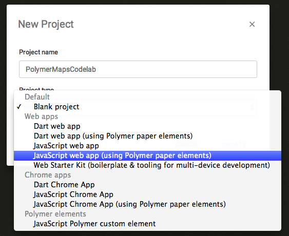
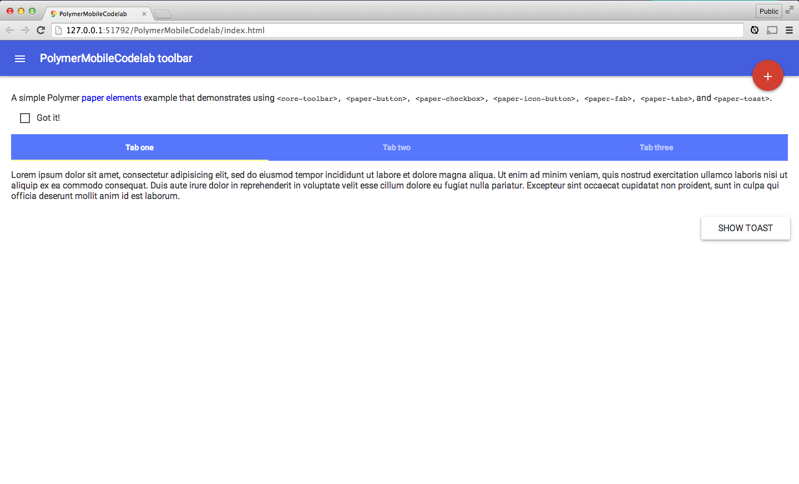

<toc-element></toc-element>

### 新しいプロジェクトを作成する

<!-- Chrome Dev Editor callout block -->
<aside class="callout">
この codelab では、Chrome アプリ IDE である **Chrome Dev Editor** を使用します。

  Run Chrome Dev Editor by clicking its icon at the bottom of your screen:
  <figure>
  
  </figure>

Chrome Dev Editor をまだインストールしていない場合は、[Chrome ウェブストアからインストールしてください](https://chrome.google.com/webstore/detail/spark/pnoffddplpippgcfjdhbmhkofpnaalpg)。

</aside>
<!-- End of Chrome Dev Editor callout block -->

Chrome Dev Editor を起動して、Polymer を使用する JavaScript アプリを作成します。

  <ul>
    <li>Chrome Dev Editor にて、
         をクリックして新規プロジェクトを開始します。</li>
  </ul>
  

    
  

  <ul>
    <li><b>Project name（プロジェクト名）</b>に <b>PolymerMobileCodelab</b> と入力します。</li>
    <li><b>Project type（プロジェクト タイプ）</b>のドロップダウン メニューから、<b>JavaScript web app (using Polymer paper elements)（JavaScript ウェブアプリ（Polymer ペーパー要素を使用））</b>を選択します。</li>
    <li><b>Create</b>（作成）ボタンをクリックします。</li>
  </ul>
  

    
  

Chrome Dev Editor が Polymer アプリの基本的な土台を作成します。また、そのバックグラウンドでは、[Bower](http://bower.io/) を使って依存関係のリスト（`polymer.js` も含む）をダウンロードし、`bower_components/` フォルダにインストールします。`bower.json` の使用方法について詳しくは次のステップで学習します。
インストール後、ディレクトリ構造は以下のようになっているはずです。

    PolymerMobileCodelab/
      bower_components/ <!-- Bower からインストールした依存関係 -->
      bower.json        <!-- 依存関係の管理用のメタデータ -->
      index.html        <!-- アプリ -->
      main.js
      styles.css

<aside class="callout">

bower の依存関係のインストール中に<strong>「Github API Limit Exceeded」</strong>（Github API の制限超過）エラーが発生した場合は、<a href="zips/PolymerMobileCodelab.zip">こちらのプロジェクト zip </a> を代用してください。

プロジェクトを解凍し、Chrome Dev Editor メニューにて <strong>Open Folder...</strong>（フォルダを開く）をクリックしてインポートします。

この中には、この codelab を最後まで進めるのに必要な依存関係がすべて含まれていますので、bower を実行する必要がありません。

このエラーは Chrome Dev Editor の一時的なバグで、次回リリースで修正される予定です。

</aside>

### アプリのプレビュー

随時、上部のツールバーにある ボタンをクリックしてアプリを実行してください。Chrome Dev Editorがウェブ サーバーを起動し、`index.html` ページを開きます。変更を加えたときにその場で表示を確認できて、大変便利です。

<figure>
  
  <figcaption>index.html のプレビュー</figcaption>
</figure>

### まとめ

このステップで学んだ内容:

- 新しい Polymer アプリケーションを作成する方法
- Chrome Dev Editor のウェブ サーバーを起動してアプリをプレビューする方法

これでプロジェクトの準備ができました。ペーパー要素を追加しましょう！
