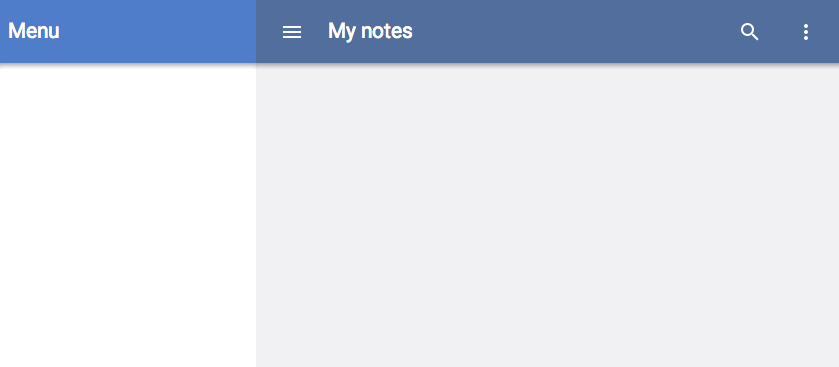
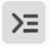

<toc-element></toc-element>

Polymer/core-* セットには、アプリのレスポンシブ レイアウト設定用の要素が多数含まれています。そのまますぐに使えるこれらの要素の一部を使って簡単に土台を作っていきましょう。

### core-drawer-panel 要素を使用する

`core-drawer-panel` を使用するための手順:

1. HTML Import を使って要素を `codelab-app.html` にロードする
2. ページ上で要素のインスタンスを宣言する

&rarr; `codelab-app.html`にて、`core-drawer-panel`、`core-header-panel`、および `core-toolbar` 用のインポートをファイルの冒頭に追加します。

    <link rel="import" href="bower_components/core-drawer-panel/core-drawer-panel.html">
    <link rel="import" href="bower_components/core-header-panel/core-header-panel.html">
    <link rel="import" href="bower_components/core-toolbar/core-toolbar.html">

&rarr; `codelab-app.html`にて、`<template>` タグ内の **Hello Polymer!** という文字列を削除し、代わりに `<core-drawer-panel>` を宣言します。ドロワー パネルは、`drawer` と `main` の 2 つの部分から構成されています。ドロワーはサイドバーで、デスクトップ アプリケーションでは開いていますが、画面サイズが `responsiveWidth` 未満のときは閉じた状態になります。`responsiveWidth` を `600px` に設定します。

    <template>
      <link rel="stylesheet" href="styles.css">
      <core-drawer-panel responsiveWidth="600px">

        <core-header-panel drawer>
        </core-header-panel>

        <core-header-panel main>
        </core-header-panel>

      </core-drawer-panel>
    </template>

&rarr; ツールバーをドロワーとメイン セクションの両方に追加します。

    <template>
      <link rel="stylesheet" href="styles.css">
      <core-drawer-panel responsiveWidth="600px">

        <core-header-panel drawer>
          <core-toolbar>Menu</core-toolbar>
        </core-header-panel>

        <core-header-panel main>
          <core-toolbar>My notes</core-toolbar>
        </core-header-panel>

      </core-drawer-panel>
    </template>

### アイコンをツールバーに追加する

Polymer には便利な [アイコン セット](http://polymer.github.io/core-icons/components/core-icons/demo.html)があり、皆さん独自のコンポーネントの中で宣言的に使用することができます。

Polymer アイコンをツールバーに追加する方法:
1. `core-icons` と `paper-icon-button` を依存関係として追加する
2. `paper-icon-button` の `icon` プロパティを使ってアイコンをページ上に表示する
3. `flex` 属性を使ってアイコンを右揃えにする

&rarr; `codelab-app.html` にて、`core-icons` と `paper-icon-button` 用の HTML Import をファイルの冒頭に追加します。前のステップで追加したインポートよりも後に置いて構いません。

    ...
    <link rel="import" href="bower_components/core-icons/core-icons.html">
    <link rel="import" href="bower_components/paper-icon-button/paper-icon-button.html">

&rarr; `paper-icon-button` 要素をツールバーに追加します。`icon` プロパティを適切なアイコン名に設定します。

    <core-header-panel main>
      <core-toolbar>
        <paper-icon-button icon="menu"></paper-icon-button>
        My notes
        <paper-icon-button icon="search"></paper-icon-button>
        <paper-icon-button icon="more-vert"></paper-icon-button>
      </core-toolbar>
    </core-header-panel>

&rarr; **My notes** を span で囲み、これに `flex` 属性を追加します。`flex` 属性を使うと、span は利用可能なスペース全体を占有し、アイコンをツールバーの右に配置します。

    <core-toolbar>
      ...
      My notes
      ...
    </core-toolbar>

&rarr; 以下のルールを `styles.css` に追加します。

    [drawer] {
      background-color: #fff;
    }

    [main] > div {
      padding: 2em;
    }

    [drawer] > core-item {
      padding: 1em;
    }

    [main] paper-checkbox {
      margin-right: 1em;
    }

    [main] {
      height: 100%;
      background-color: #f1f1f3;
    }

    [drawer] core-toolbar {
      background-color: #4F7DC9;
      color: #fff;
    }

    [main] core-toolbar {
      background-color: #526E9C;
      color: #fff;
    }

&rarr; **index.html** を選択して、 ボタンでアプリのプレビューを表示します。すると、ページには基本的なレイアウトが表示されるはずです。

<figure>
  
  <figcaption>基本的な土台ができた index.html </figcaption>
</figure>

### アプリがレスポンシブかを確かめる

レイアウトがレスポンシブになっているかを確かめるため、Chrome にて Nexus 5 をエミュレーションします。

&rarr; ページ上で右クリックして Chrome Developer Tools を開き、**Inspect element** を選択します。

&rarr;  ボタンをクリックしてドロワーを開きます。

&rarr; *Emulation* タブを選択し、ドロップダウンから *Nexus 5* を選択して *Emulate* をクリックします。
ページは、選択したデバイスの解像度に合った表示に変わらなければなりません。

&rarr; ページを再読み込みします。ドロワーはデフォルトで非表示になっているはずです。

### まとめ

このステップで学んだ内容:

- モバイルに適した基本レイアウトになるよう `<core-drawer-panel>` と `<core-toolbar>` を使用する
- Polymer アイコンを使用する
- モバイル端末のエミュレーションを使用してアプリのプレビューを表示する

## 次のステップ

モバイル端末上では、ドロワーはデフォルトでは閉じている状態です。ドロワーを開くためのメニュー ボタンを追加します。
