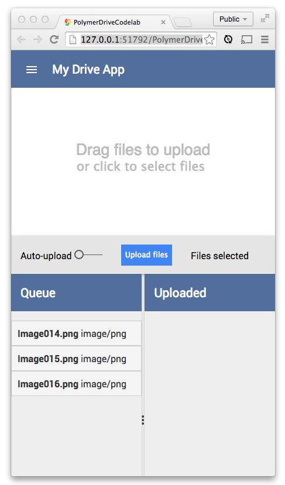

<toc-element></toc-element>

<!-- Chrome Dev Editor callout block -->
<aside class="callout">
このcodelab では、Chrome アプリ IDE である **Chrome Dev Editor** を使用します。

  Run Chrome Dev Editor by clicking its icon at the bottom of your screen:
  <figure>
  
  </figure>

Chrome Dev Editor をまだインストールしていない場合は、[Chrome ウェブストアからインストールしてください](https://chrome.google.com/webstore/detail/spark/pnoffddplpippgcfjdhbmhkofpnaalpg)。

</aside>
<!-- End of Chrome Dev Editor callout block -->

この codelab では [Polymer](http://polymer-project.org) を使い、Web Component をベースにした*モバイル フレンドリー*な Google ドライブ クライアントを構築します。

Web Components とは、ウェブ プラットフォームの各種機能をセットにしたもので、コンポーネントを組み合わせて宣言的にアプリケーションを作成することができます。 カスタム要素（Custom Element）や Shadow DOM といった新しいウェブ プラットフォーム技術がベースになっており、カプセル化された、使いまわしできる要素を作成することが可能です。

Polymer では現在、データ バインディングやレイアウト、式といった機能を提供するシュガリング レイヤー と合わせて Web Components を使用することができます。

既製の [Google Web Components](http://github.com/googlewebcomponents) の一部を実際に使い、楽しく、かつ機能するものを作っていきます。時間は 30 分とかかりません。

完成するとこのようになります。

<figure>
  
  <figcaption>完成したアプリ</figcaption>
</figure>

## 次のステップ

アプリ作成のための準備をしましょう！
