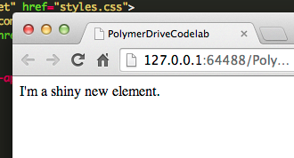

<toc-element></toc-element>

このステップでは要素を作成して、Google ドライブにファイルをアップロードするための UI とロジックを入れる要素を作成します。

###新しい要素を作成する

  <ul>
    <li>Chrome Dev Editor のサイドバーにて **PolymerDriveCodelab** ラベルを右クリックします。</li>
    <li>ドロップダウンから **New File**（新しいファイル）を選択します。</li>
  </ul>
  

    
  

  <ul>
    <li>この新しいファイルに **drive-app.html** という名前を付けます。</li>
  </ul>
  

    
  

&rarr; このファイルにて、要素作成の出発点としてボイラープレート（boilerplate）を以下のように貼り付けます。

    <link rel="import" href="bower_components/polymer/polymer.html">

    <polymer-element name="drive-app">

      <template>
        <link rel="stylesheet" href="drive-app.css">

        I’m a shiny new element. 

      </template>
      

    </polymer-element>

これは、`<drive-app>` 要素を、アプリが使用できるタグとして定義するコードです。このインポートによって、作成中に Polymer のシュガーを使用できるようになります。

  <ul>
    <li>
      <strong>前のステップを繰り返し</strong>て、`drive-app.css` ファイルも作成します。このファイルは、今は空白のままにしておいてください。
    </li>
    <li>
      `main.js` と `styles.css` ファイルは、このチュートリアルでは使用しませんので、<strong>削除</strong>します。
    </li>
  </ul>

### 要素をインポートする

`<drive-app>` 要素を使用するために必要な手順:

1. HTML Import を使って要素を `index.html` にロードする
2. ページ上で要素のインスタンスを宣言する

&rarr; `index.html` の編集を始めます。

&rarr; `index.html` の `<head`> にて、そこにあるすべてのインポートを**削除**し、**以下の行を追加**します。`webcomponents.js` のスクリプトの後ろに置くようにしてください。

    
  
    <link rel="import" href="drive-app.html">

これが終わったら、ドキュメントの `<head>` は以下のようになっているはずです。

    <head>
      <title>PolymerDriveCodelab</title>

      <meta name="viewport" content="width=device-width, initial-scale=1.0, maximum-scale=1.0">
      <meta name="mobile-web-app-capable" content="yes">
      <meta name="apple-mobile-web-app-capable" content="yes">

      
      
      <link rel="import" href="drive-app.html">
    </head>

&rarr; `<body>`にて、そこにあるすべての内容を **削除**して、`<drive-app>` 要素の**インスタンスを宣言**します。

    <drive-app></drive-app> 

### アプリのプレビュー

`index.html` を選択してボタンをクリックすると、ブラウザの表示は以下のようになるはずです。

<figure>
  
  <figcaption> アプリの現在の UI </figcaption>
</figure>

上出来です。あなたの最初の Polymer 要素ができました。これに手を加えていきましょう！

## 次のステップ

既存の Polymer 要素をいくつかインストールして、アプリで使えるようにします。

