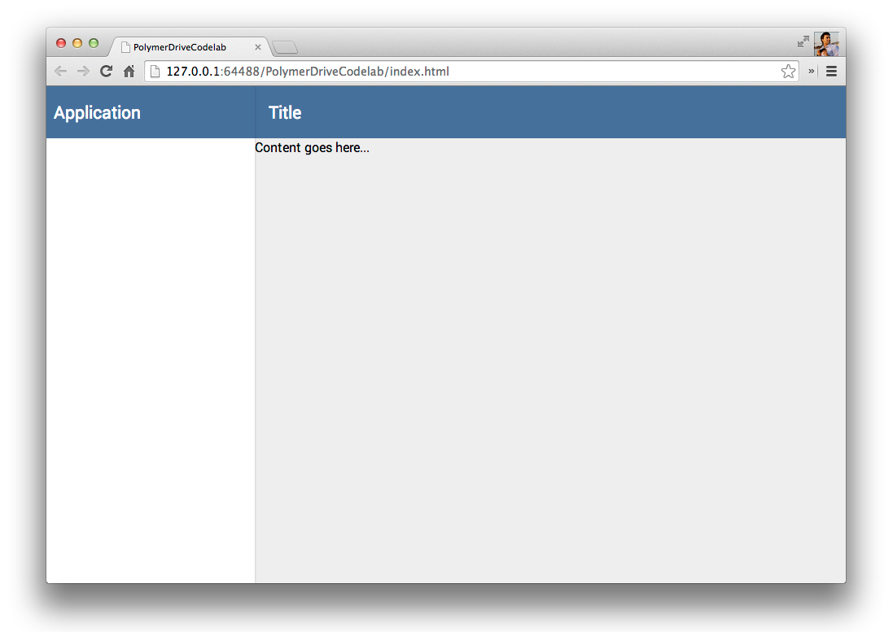
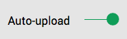

<toc-element></toc-element>

このステップでは、アプリケーション作成を始めるときに活用できる既存の Polymer 要素を、Bowser を使っていくつか取得します。 

### 下準備

アプリのユーザー インターフェースに役立つと思われるものがいくつかあります。

まず、UI には**ツールバー**があるとよいでしょう。アプリの上部に 1 つ、下の方に 1 つ設置します。

<figure>
  
  <figcaption>ツールバー</figcaption>
</figure>

さらに、ツールバー とコンテンツ用領域を持つ**レスポンシブ レイアウト** は便利です。 

<figure>
   
  <figcaption>レスポンシブ レイアウト</figcaption>
</figure>

**スプリッター**があれば、どれがアップロード待ちで、どれが正常にドライブに追加されたかがユーザーに分かりやすくなります。

<figure>
  
  <figcaption>スプリッター</figcaption>
</figure>

**トグル**ボタンがあれば、ユーザーはファイルを自動アップロードするのか、または別のボタンで手動アップロードするのかを選択できます。

<figure>
  
  <figcaption>トグル ボタン</figcaption>
</figure>

こういった既製の要素のインストールには Bower を使用します。

<aside class="callout">
  <b>Bower とは？</b>
  
<a href="http://bower.io/">Bower</a> は、クライアント側のパッケージ管理ツールで、どんなウェブ アプリでも使用することができ、面倒な依存関係を管理してくれます。Polymer コンポーネントはすべて、自身の依存関係を定義しています。Bower を使って Polymer コンポーネントをインストールすると、コンポーネントとその依存関係が <code>bower_components/</code> の中にインストールされます。

</aside>

### 要素をインストールする

通常は、`bower install Polymer/core-scaffold Polymer/core-splitter PolymerLabs/polymer-ui-toggle-button --save` をコマンドライン上で実行して要素をインストールしますが、Chrome Dev Editor には Bower コマンドを実行するコマンドラインがありません。代わりに、手動で `bower.json` を編集して要素を追加したのち、Chrome Dev Editor の Bower Update 機能を使って要素を `bower_components/` にダウンロードします。

&rarr; `bower.json` を編集して、上記の要素をdependencies（依存関係）に追加します。

    "dependencies": {
      "polymer": "Polymer/polymer#master",
      "paper-elements": "Polymer/paper-elements#master",
      "core-splitter": "Polymer/core-splitter#master",
      "core-scaffold": "Polymer/core-scaffold#master"
    }

  <ul>
    <li>エディターにて、ファイル名 **bower.json** を右クリックします。</li>
    <li>ドロップダウンから **Bower Update**（Bower 更新）を実行します。</li>
  </ul>
  

    
  

ダウンロード時間はおそらく数秒です。
要素（および依存関係）がインストールされたかどうかは、以下に示すディレクトリが作成されてそこにファイルが入っているかで確認できます。

* `bower_components/core-splitter`
* `bower_components/core-scaffold`

## 次のステップ

このステップでインストールした要素を使う方法を学び、アプリの UI を構築していきます。
