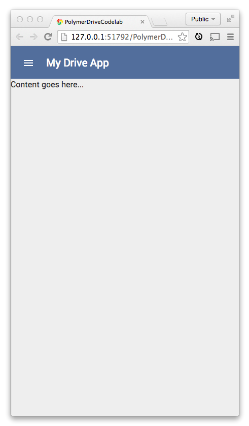

<toc-element></toc-element>

インストールした要素を使用するために必要な手順:

1. [HTML Import](http://www.polymer-project.org/platform/html-imports.html) を使って要素を `drive-app.html` にロードする
2. 要素のインスタンスを宣言する

### インストールした要素をインポートする

&rarr; `drive-app.html` にて、以下の HTML Imports をファイルの冒頭に追加して要素をロードします。

    <link rel="import" href="bower_components/core-scaffold/core-scaffold.html">
    <link rel="import" href="bower_components/core-splitter/core-splitter.html">
    <link rel="import" href="bower_components/paper-toggle-button/paper-toggle-button.html">

**重要**: 上記のインポートは、必ず `polymer.html` のインポートの**後**にしてください。

これで、アプリにて要素を使用できるようになりました。

### `<core-scaffold>` でページをレイアウトする

&rarr; `drive-app.html` 内の `<template>` にて、`I’m a shiny new element` を以下に示すコード スニペットで置き換えます。

これは、マークアップで `<core-scaffold>` を宣言するコードで、アプリに**ツールバー**、**メニュー**、アプリの**コンテンツ**用の領域ができます。

    <core-scaffold>
      <core-header-panel navigation flex mode="seamed">
        <core-toolbar>
          Application
        </core-toolbar>
      </core-header-panel>
  
      
My Drive App

  
      
Content goes here... 

    </core-scaffold>

&rarr; 以下のコードを `drive-app.css` に追加します。

    core-scaffold {
      font-family: 'Roboto', Arial;
    }

**アプリを実行する**

&rarr; `index.html` を選択してボタンをクリックすると、以下のように表示されるはずです。

<figure>
  
  <figcaption>アプリの現在の UI</figcaption>
</figure>

お分かりのように、`<core-scaffold>` は完全に宣言型です。
ハンバーガー メニュー アイコンをクリックすると、以下のように展開します。

<figure>
  
  <figcaption>メニューをクリックすると左側のエリアが表示されます</figcaption>
</figure>

### ツールバーのスタイルを設定する

サイドバーのスタイルをほんの少し変える ため、以下の CSS を `drive-app.css` に追加します。

    core-toolbar {
      background-color: #526E9C; 
      color: #fff;
    }

いいですね。見てみましょう。

<figure>
  
  <figcaption>アプリの現在の UI </figcaption>
</figure>

### まとめ

このステップで学んだ内容:

* Bower を使って Polymer 要素をインストールする
* 要素を使い、宣言的にツールバーを設置する
* CSS を使ってカスタム要素のスタイルを設定する

## 次のステップ

次は、ユーザー サインイン後のアプリの姿を、ファイルのアップロードに必要なものを加えて整えていきましょう。 
