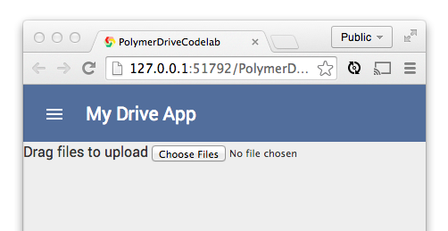

<toc-element></toc-element>

ファイルを Google ドライブにアップロードする場合、ユーザーは先に Google アカウントにサインインしていなければなりません。 

つまり、アプリは、ユーザーがサインインする前にはある UI を見せ、サインインした後には別の UI を見せる必要があります。

### サインイン後 UI 用の場所を作成する

&rarr; 前のステップで見た "Content goes here...（コンテンツがここに入る…）" というプレースホルダー div を、サインイン後 UI を入れるシンプルな `
` 要素に置き換えます。

    

      ...
    

### ファイル選択エリアを作成する

"loggedin" div には、ユーザーがアップロードするファイルを選択できるエリアが必要です。
アプリをデスクトップ PC で実行する場合は、ユーザーはファイルをドラッグ＆ドロップすることがあります。アプリをモバイル端末で実行している場合は、ファイルを選択するボタンのタップ操作ができなければなりません。

&rarr; "loggedin" `
` の中に、ファイル選択ボタン付きのドロップゾーンを作成します。

    

      

        Drag files to upload
        <input type="file" id="files" name="files[]" 
          on-change="{{handleFilePick}}" multiple>
      

    

`index.html` を選択して でアプリをプレビューすると、以下のように表示されるはずです。

<figure>
  
  <figcaption>アプリの現在の UI</figcaption>
</figure>

この状態では、ファイルをドラッグ＆ドロップするための十分なスペースがまだありません。

&rarr; 以下のコードを `drive-app.css` に追加して、ドラッグ＆ドロップエリアの表示に手を加えます。

    #dropzone {
      -moz-border-radius: 5px;
      -webkit-border-radius: 5px;
      border-radius: 5px;
      padding: 90px 10px;
      text-align: center;
      font: 20pt bold 'Helvetica';
      color: #bbb;
      background: white;
    }
    
    #files {
      display: block;
      margin: 0 auto;;
    }
    
    #files::-webkit-file-upload-button {
      visibility: hidden;
    }
    
    #files::before {
      content: 'or click to select files';
      background: white;
      padding: 5px;
      outline: none;
      white-space: nowrap;
      -webkit-user-select: none;
      cursor: pointer;
      font-size: 16pt;
      margin: 0 auto;
    }
    
    #files:hover::before {
      border-color: black;
    }
    
    #files:active::before {
      background: -webkit-linear-gradient(top, #e3e3e3, #f9f9f9);
    }

アプリは以下のように表示されるはずです。

<figure>
  
  <figcaption>アプリの現在の UI</figcaption>
</figure>

アップロードを実際に実行するイベントやドラッグ＆ドロップ ロジックの追加についてはまだ心配しないでください。その作業はもう少し後の方で行います。

### ボタンをツールバーに追加する

先ほど作成したものの中に `<core-toolbar>` 要素があったことにお気づきかもしれません。早速、この要素を再利用して 2 つめの `<core-toolbar>` をアプリに追加しましょう。

このツールバーは、「loggedin」（ログイン後）ビューのドロップゾーンの下に配置されます。選択ファイルを_自動で_アップロードするか（個々のファイルが選択されるとすぐにアップロード）、またはユーザーが Upload ボタンをクリックしたときだけにアップロードするかを切り替えるのに使用します。ツールバー内のアイコンと中身はすべて、レイアウトに応じて伸縮しなければなりません。

そういった UI は、要素をいくつか使うことで実現します。具体的には、`polymer.html` に付属するレイアウト ヘルパーと、`<core-toolbar>` および `<paper-toggle-button>` を使用します。
さらに、ツールバーにラベルを追加して現在のアップロード状態を表示させて、ユーザーが現状を把握できるようにします。

&rarr; ドロップゾーン `
` の終了タグ `
` の直後に、以下のコードを追加します。

    <core-toolbar layout horizontal id="dropzone-bar">
      

        Auto-upload
        <paper-toggle-button 
        checked="{{autoUpload}}">
        </paper-toggle-button>
      

      

        <button id="upload"
        on-click="{{manualUpload}}" 
        style="display:{{ autoUpload ? 'none' : 'inline-block' }}">
          Upload files
        </button>
      

      

      

        
Ready

      

    </core-toolbar>

&rarr; ツールバーにスタイルを少し設定します。これも `drive-app.css` ファイルの中で以下のように設定します。

    #dropzone-bar {
      border-bottom:1px solid white;
      background: rgb(229, 229, 229);
      color: black;
      box-shadow: rgba(0, 0, 0, 0.298039) 0px 1px 8px;
      font-size: 1em;
    }

### アプリを実行する

`index.html` を選択して  ボタンをクリックします。すると、細部が加わった `<core-toolbar>` が表示されるはずです。
アプリが徐々に形になってきました。

<figure>
  
  <figcaption>アプリの現在の UI</figcaption>
</figure>

## 次のステップ

次は、ユーザーがアップロードしたファイルを表示するエリアを追加します。
