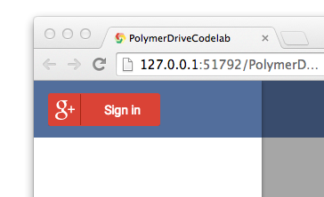
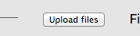

<toc-element></toc-element>

このステップでは、Google アカウントでの**認証**サポートを追加します。

<figure>
  
  <figcaption>Google 認証 UI</figcaption>
</figure>

### &lt;google-signin>をインストールする

認証をサポートする場合、既存の要素 `<google-signin>` が使用できます。この要素は認証ボタンをはじめ、Google の認証に必要なすべての仕組みを提供します。

要素は以下のように表示されます。

<figure>
  
  <figcaption> &lt;google-signin> 要素の UI</figcaption>
</figure>

早速、要素を追加しましょう。

&rarr; 再び `bower.json` を編集して、「google-signin」要素への参照を追加します。

    "dependencies": {
      "polymer": "Polymer/polymer#master",
      "paper-elements": "Polymer/paper-elements#master",
      "core-splitter": "Polymer/core-splitter#master",
      "core-scaffold": "Polymer/core-scaffold#master",
      "cors-upload-sample": "googledrive/cors-upload-sample#master",
      "google-signin": "GoogleWebComponents/google-signin"
    }

  <ul>
    <li>Chrome Dev Editor にて、ファイル名 **bower.json** を右クリックします。</li>
    <li>ドロップダウンから**Bower Update** を実行します。</li>
  </ul>
  

    
  

&rarr; `drive-app` の冒頭で、すでにそこにあるインポートと並べて `<google-signin>` 用の HTML import を追加します。

    <link rel="import" href="bower_components/google-signin/google-signin.html">

&rarr; `drive-app` 要素の `<template>` の中で、最初の `<core-toolbar>` 内に `<google-signin>` 要素のインスタンスを追加し、既存の内容を置き換えます。

    <google-signin></google-signin>

### &lt;google-signin> を設定する

有効な **clientId**、**scopes**、さらに、ユーザーがサインインしたか、またはサインアウトしたかを区別するのにアプリが使用するイベントをいくつか加えるため、要素に多少の設定を加える必要があります。

**注:**

下記の「YOUR_CLIENT_ID_GOES_HERE」と記述されているプレースホルダー テキストを、有効なクライアントID で置き換えます。この ID を取得するには、[Google デベロッパー コンソール](https://console.developers.google.com/project) から自分のデベロッパー API キーを取得しなければなりません。Google ドライブ API を有効にして、[http://127.0.0.1:51792/](http://127.0.0.1:51792/) を承認済みクライアントのリストに追加します（これは、Chrome Dev Editor がアプリを実行する IP とポートです。独自のサーバーを使っている場合は、IP とポートが一致することを console.developers.google.com 上で確かめてください）。**API's & auth > Consent screen** メニューにて、アプリケーションに `Product Name`（プロダクト名）と `Email Address`（E メール アドレス）を必ず渡してください。
  
&rarr; 属性を `google-signin` タグに追加します。

  <code><pre>
    &lt;google-signin         on-google-signin-success=&quot;{{signedIn}}&quot;         on-google-signed-out=&quot;{{signedOut}}&quot;         clientId=&quot;YOUR_CLIENT_ID_GOES_HERE&quot;         scopes="https://www.googleapis.com/auth/drive" &gt;     &lt;/google-signin&gt;
  </pre></code>

  <code><pre>
    &lt;google-signin         on-google-signin-success=&quot;{{signedIn}}&quot;         on-google-signed-out=&quot;{{signedOut}}&quot;         clientId=&quot;$IO_CLIENT_ID2_WEB_APPLICATION&quot;          scopes="https://www.googleapis.com/auth/drive" &gt;     &lt;/google-signin&gt;
  </pre></code>

上記の「[https://www.googleapis.com/auth/drive](https://www.googleapis.com/auth/drive)」スコープは、ユーザーのサインイン時に、ドライブ アカウントへのファイル アップロードを許可するプロンプトをユーザーに必ず出すようにするためのものです。

### イベントを追加する

この `<google-signin>` 要素は、ユニークなイベント セットを起動し、認証が成功してファイルを自身のドライブ アカウントにアップロードできるようになったことをユーザーに通知します。

ここで考慮するイベントは、「google-signin-success」と「google-signed-out」です。

&rarr; 以下のイベント処理関数を、`drive-app` 要素内で先ほど書いた JavaScript の末尾に追加します。

    signedIn: function (e) {
      this.accessToken = e.detail.result.access_token;
      this.$.loggedin.style.display = 'block';
    },

    signedOut: function (e) {
      this.$.loggedin.style.display = 'none';
    }

### アプリを実行する

アプリケーションはこのようになりました。

<figure>
  
  <figcaption>アプリの現在の UI</figcaption>
</figure>

ここには Authorize（許可）ボタンが含まれています。このボタンをクリックすると、ウィンドウが開き、ユーザーは Google ドライブへの認証手続きに進めます。

<figure>
  
  <figcaption>authorize（許可）ボタン</figcaption>
</figure>

ポップアップ ウィンドウは以下のようになります。

<figure>
  
  <figcaption>ポップアップ ウィンドウ</figcaption>
</figure>

ユーザーがサインインすると、各自のドライブ アカウントへのファイル アップロードをアプリに許可するようプロンプトが出ます。 

ファイルをメイン ウィンドウにドラッグするか、**click to select files**（クリックしてファイルを選択）リンクをクリックして、ファイルをキューに追加します。

<figure>
  
  <figcaption>ファイル選択 UI</figcaption>
</figure>

ユーザーがファイルを選択すると、**Queue**（キュー）には、アップロード待ちファイルの一覧が表示されます。

<figure>
  
  <figcaption>Queue パネル</figcaption>
</figure>

ユーザーはここで**Upload files**（ファイルをアップロード）ボタンをクリックして、選択したファイルをドライブにアップロードします。

<figure>
  
  <figcaption>Upload files ボタン</figcaption>
</figure>

アップロードが成功すれば、**Uploaded**（アップロード済み）パネルにファイルの名前と、ウェブで表示させるためのリンクの両方が表示されます。

<figure>
  
  <figcaption>Uploaded パネル</figcaption>
</figure>

やりました！ これで、Polymer を使った Google ドライブ アプリが完全に動作するようになりました。

### 仕上げにスタイルを追加する

ゴールはもう目の前です。仕上げにスタイルを追加して、アプリを完成させましょう。

この最終的なスタイルの微調整作業には、ユーザーが認証済みのとき_のみ_にサインイン 後ビューが表示されることの確認、また、小さい画面でもアプリの要素が適切に表示されることの確認も兼ねています。

&rarr; 以下のスタイルを、`drive-app` 要素の `<style>` タグの中にコピー＆ペーストします。

    .filelist {
      padding-left: 0px;
      list-style-type: none;
    }

    .filelist li {
      background: #F5F5F5;
      padding: 10px 10px;
      border: 1px solid #ccc
    }

    #loggedin {
      display: none;
      right: 0;
    }

    #dropzone-bar {
      right: 0;
      position: relative;
    }

    core-splitter {
      height: 500px;
    }

    .container {
      width: 400px;
      height: 500px;
    }

    #file-splitter {
      width: 100%;
      overflow: visible;
    }

    #upload {
      border: 1px solid rgba(0, 0, 0, 0);
      color: rgb(255, 255, 255);
      background-color: rgb(65, 132, 243);
      height: 36px;
      line-height:27px;
      font-size: 0.8em;
    }

    @media (max-width: 500px) {
      .panel { width: 100% }
    }

これらのスタイルを加えることで、サインイン後のビューは、ユーザーが認証されるまで非表示となります。サインアウトしたユーザーに対しては、アプリの表示は以下のようになります。

<figure>
  
  <figcaption>サインアウト後の UI</figcaption>
</figure>

これらのスタイルには、画面が小さめの端末上でも、アプリの見た目や動作を少しでもよくするための微妙な調整が含まれています。例えば、**Upload files** ボタンは、ほんの少しタッチ ターゲットが大きくなっています。

<figure>
  
  <figcaption>スタイル再調整後の Upload files ボタン</figcaption>
</figure>

素晴らしいですね。

**Auto-upload**（自動アップロード）モードも確かめてみてください。
ボタンを切り替えて、ファイルをいくつか選択します。するとファイルがドライブにアップロードされていきます！

<figure>
  
  <figcaption>Auto-upload モード</figcaption>
</figure>

### まとめ

このステップで学んだ内容:

* `<google-signin>` を使ってアプリに認証を追加する
* サインインを組み込んで、ユーザーがサインインしているときだけにアップロード機能がアプリに表示されるようにする
* モバイル ウェブ アプリを最適化して美しく表示されるようにする
