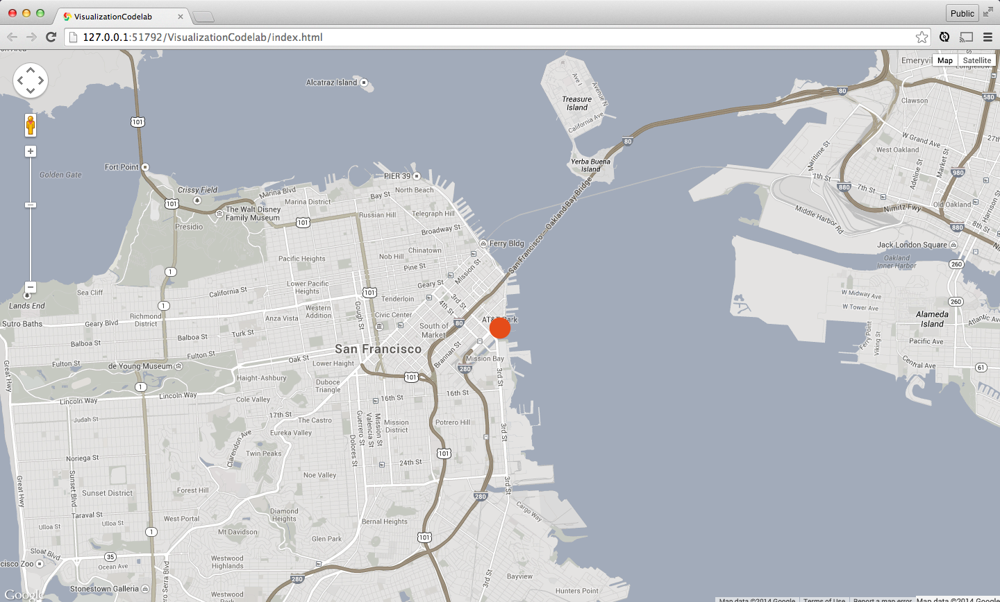

<toc-element></toc-element>

[CanvasLayer](https://github.com/brendankenny/CanvasLayer) ライブラリを使い、それが待つ独自の Polymer 要素 `<point-overlay>` でデータを囲んで、地図上にデータを描画していきます。Maps API 自体には、データの視覚化用のオプションが多数含まれていますが、CanvasLayer は、WebGL コンテンツを地図上に描画できるようにするもので、何百万個のアイテムを画面上にリアルタイムで描画することができます。

### &lt;point-overlay> 要素をインストールする

ここでも、Bower を使ってコードを取得します。

&rarr; `bower.json` を編集して、`point-overlay` を `dependencies` に追加します。

    "dependencies": {
      "polymer": "Polymer/polymer#master",
      "paper-elements": "Polymer/paper-elements#master",
      "google-map": "GoogleWebComponents/google-map#master",
      "point-overlay": "brendankenny/point-overlay#master"
    }

  <ul>
    <li>エディターにて、ファイル名 `bower.json` を右クリックします。</li>
    <li>ドロップダウンから <b>Bower Update</b>（Bower 更新）を実行します。</li>
  </ul>
  

    
  

### &lt;canvas-layer> 要素を追加する

&rarr; `index.html` にて、`<point-overlay>` 用の HTML Import を新たに追加します。

    <head>
      ...
      
      <link rel="import" href="bower_components/google-map/google-map.html">
      <link rel="import" href="bower_components/point-overlay/point-overlay.html">
    </head>

前のステップで、`<google-map>` 要素の基本的な Maps オブジェクトにアクセスするのに、`map` プロパティを使ってアクセスする Javascript を書きました。`<point-overlay>` 要素にも*同じく* `map` プロパティがありますが、これは地図を提供するものではないため、そこに地図を必要とします。`<google-map>` 要素の `map` を `<point-overlay>` 要素の map にバインドさせることで、両者がオブジェクトを共有できるようにします。

`<google-map>` と `<point-overlay>` の両者とも、自身の `map` プロパティを[公開プロパティ](http://www.polymer-project.org/docs/polymer/polymer.html#published-properties) として公開します。よって、`map` **属性** に対して `{{}}` バインディングを使用して、両者の `map` **プロパティ** をバインドすることができます。

<aside class="callout">
  <b>公開プロパティとは？</b>
  
<a href="http://www.polymer-project.org/docs/polymer/polymer.html#published-properties">公開プロパティ</a>の場合、ユーザーはプロパティの設定を、同じ名称の HTML 属性を使って行うことができます。例えば <code>myElement.foo = 'hi there'</code> のように JavaScript でプロパティを設定するのではなく、<code>&lt;my-element foo="hi there">&lt;/my-element></code> という属性を宣言するのです。公開プロパティは、双方向データ バインディングをサポートしているので便利です。

</aside> 

&rarr; 既存の `<google-map>` を `<template is="auto-binding">` で囲みます。

<aside class="callout">
  <b>Polymer の外でのデータ バインディング</b>
  
Polymer は <a href="http://www.polymer-project.org/docs/polymer/databinding.html">双方向のデータ バインディング</a>をサポートしています。データ バインディングが便利なのは、要素同士を、それらの属性を使ってつなげることができる点です。それは JavaScript でもできますが、コンポーネント間のデータ共有を宣言的に行う方法の方が、より明確で便利な場合があります。

  
Polymer のデータ バインディング機能は、<code>&lt;polymer-element></code> の作成時にしか使えません。ただし、Polymer は「auto-binding」という <code>&lt;template></code> の <a href="http://www.html5rocks.com/en/tutorials/webcomponents/customelements/#typeextension">type-extension（型拡張）</a>バージョンを提供しています。これを使えば、要素の外側で <code>{{}}</code> バインディングを使用できます。

  
コードの本番制作時には、中身のすべてをカプセル化する適切な Polymer 要素を作成する方法の方が理にかなっていますが、<code>auto-binding</code> は、プロトタイプ制作および素早い繰り返し作業用ツールとして非常に便利です。

</aside> 

&rarr; `<google-map>` の `map` 属性を `<point-overlay>` の `map` 属性にバインドします。必ず `<template is="auto-binding">` の中で行ってください。

    <body>
      <template is="auto-binding">
        <google-map map="{{map}}" latitude="37.779" longitude="-122.3892" zoom="13"></google-map>
        <point-overlay map="{{map}}"></point-overlay>
      </template>

      
    </body>

`auto-binding` テンプレートは、そのコンテンツがページに追加されると、`template-bound` イベントを起動します。`main.js` のコードが機能し続けられるよう、この `template-bound` イベントを待ち受ける必要があります。

&rarr; `main.js` をアップデートして、`google-map` 要素をクエリする前に `template-bound` イベントを待つようにします。

    var tmpl = document.querySelector('template');
    tmpl.addEventListener('template-bound', function() {
      var mapElement = document.querySelector('google-map');
      mapElement.addEventListener('google-map-ready', mapLoaded);
    });

    function mapLoaded(e) {
      ...
    }

### 点を描く

ここでようやく、実際に描くデータが `<point-overlay>` で必要になります。この後で、データセット全体をバインドしますが、まずは簡単に 1つの点から始めてみましょう。

`<point-overlay>` には、データを入れる `data` プロパティがあります。`<point-overlay>` はオブジェクトの配列を待ち、オブジェクトが特定のプロパティを持っているときに、そのオブジェクトの点をどう描くかを把握しています。必要とするプロパティは、点の緯度と経度を示す `lat` と `lng` のみです。

最初に、地図の中心を配列に入力して、点の描画を開始します。

    [
      {
        "lat": 37.779,
        "lng": -122.3892
      }
    ]

&rarr; 点をハードコード化して、直接テンプレートに入れます。前のステップで使った `<point-overlay>` は、ここで以下のようになります。

    <point-overlay map="{{map}}" data='[{"lat": 37.779, "lng": -122.3892}]'></point-overlay>

**重要**: `data` 属性の値を囲むのはシングル クォーテーション マークであることに注意してください。こうすることで値内のダブル クォーテーション マークが正しくパースされます。

Polymer は、これがオブジェクトの配列であることを認識し、`JSON.parse` を使ってパースし、それを `<point-overlay>` インスタンスに渡します。

### アプリを実行する

 ボタンをクリックすると、`<point-overlay>` によって描かれた最初の点が地図上に表示されるはずです。

<figure>
  
  <figcaption>点が表示された index.html </figcaption>
</figure>

### まとめ

このステップで学んだ内容:

- `auto-binding` テンプレートの中で Polymer 要素をバインドする
- `<point-overlay>` と `<google-map>` とを、それぞれの `map` プロパティをバインドすることで結び付ける
- `<point-overlay>` のデータの一部をハードコード化し、描画する 

### 次のステップ

大量のデータを描画します。
