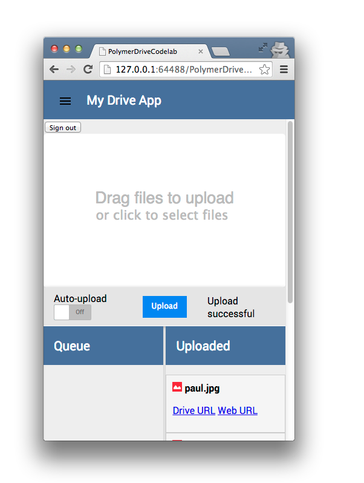

<toc-element></toc-element>

<!-- Chrome Dev Editor callout block -->
<aside class="callout">
This codelab uses **Chrome Dev Editor**, a Chrome app IDE.

  Run Chrome Dev Editor by clicking its icon at the bottom of your screen:
  <figure>
  
  </figure>

If you don't have it installed yet, please
[install it from Chrome Web Store](https://chrome.google.com/webstore/detail/spark/pnoffddplpippgcfjdhbmhkofpnaalpg).

</aside>
<!-- End of Chrome Dev Editor callout block -->

This codelab uses [Polymer](http://polymer-project.org) to build a *mobile-friendly*, Web Component-based Google Drive client.

Web Components are a new set of web platform features that enable developers to build applications in a declarative, composable way. They build on new web platform technologies like Custom Elements and Shadow DOM to allow you to create encapsulated, reusable elements.

Polymer allows you to use Web Components today, with a layer of sugaring that offers features like data-binding, layout and expressions.

You’ll get a chance to play with some pre-made [Google Web Components](http://github.com/googlewebcomponents) and build something fun and functional in under 30 minutes.

Here’s what the final product will look like:

<figure>
  
  <figcaption>The final app</figcaption>
</figure>

## Next up

Let's get set up to build the app!
